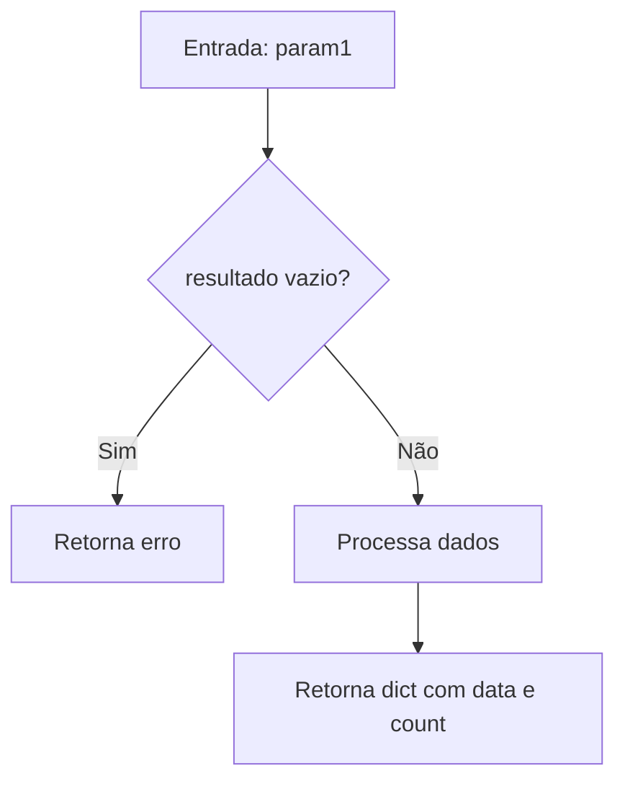
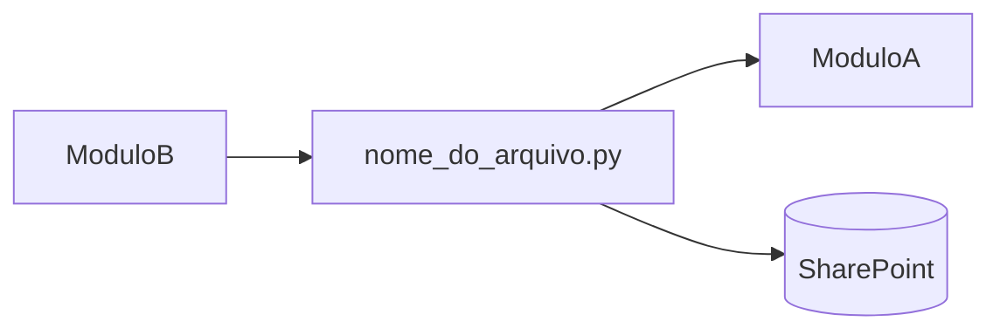

# Formato de Saída Docusaurus

## Estrutura de Diretórios Gerada

```
docs/
├── intro.md                        # Visão geral do sistema
├── architecture.md                 # Arquitetura e decisões de design
├── improvements.md                 # Problemas identificados e sugestões
├── modules/
│   ├── overview.md                 # Mapa de todos os módulos
│   └── integrations.md             # Integrações externas mapeadas
├── files/
│   ├── server.md                   # Documentação de server.py
│   ├── app.md                      # Documentação de app.py
│   ├── config.md                   # Documentação de config.py
│   ├── services.md                 # Documentação de services.py
│   ├── routes.md                   # Documentação de routes.py
│   ├── excel-processor.md
│   ├── powershell-executor.md
│   ├── encoding-repair.md
│   ├── state.md
│   ├── report-generator.md
│   └── correction-helper.md
├── functions/
│   └── index.md                    # Índice de todas as funções
├── classes/
│   └── index.md                    # Índice de todas as classes
└── scripts/
    └── overview.md                 # Documentação dos scripts externos
```

---

## Template: `intro.md`

```markdown
---
sidebar_position: 1
title: Introdução
---

# [Nome do Sistema]

## O que é este sistema?
[Descrição em 2-3 parágrafos do propósito central]

## Problema que resolve
[Contexto de negócio]

## Stack tecnológico
| Componente | Tecnologia | Versão |
|---|---|---|
| Backend | Python / Flask | 3.x |
| Automação | PowerShell | 5.1 |
| Integração | SharePoint Online | PnP |

## Como navegar nesta documentação
- **Arquitetura**: visão macro do sistema
- **Files**: documentação por arquivo de código
- **Módulos**: agrupamento por domínio funcional
- **Integrações**: sistemas externos conectados
```

---

## Template: `architecture.md`

```markdown
---
sidebar_position: 2
title: Arquitetura
---

# Arquitetura do Sistema

## Visão Geral
[Descrição da arquitetura em linguagem natural]

## Diagrama de Componentes


## Camadas da Aplicação
### Camada de Apresentação
### Camada de Serviços
### Camada de Dados / Integração

## Decisões de Design
| Decisão | Alternativa Considerada | Motivo da Escolha |
|---|---|---|
| Flask sobre FastAPI | FastAPI mais moderno | Compatibilidade com stack existente |

## Fluxo Principal de Execução
```mermaid
sequenceDiagram
    ...
```
```

---

## Template: Página de Arquivo (`files/<nome>.md`)

```markdown
---
sidebar_position: N
title: nome_do_arquivo.py
---

# `nome_do_arquivo.py`

## Responsabilidade

> [Uma frase que resume a razão de existência deste arquivo]

[Parágrafo explicando o papel deste módulo na arquitetura geral e por que ele foi criado separadamente]

## Localização

```
backend/nome_do_arquivo.py
```

## Dependências

### Internas
| Módulo | Por quê é importado |
|---|---|
| `config` | Acessa constantes de configuração global |

### Externas
| Biblioteca | Propósito |
|---|---|
| `pandas` | Leitura e manipulação de dados Excel |

---

## Funções

### `nome_da_funcao(param1: tipo, param2: tipo) -> tipo_retorno`

**Propósito**: [O que esta função realiza e por que existe]

**Parâmetros**:
| Nome | Tipo | Obrigatório | Descrição |
|---|---|---|---|
| `param1` | `str` | Sim | [descrição] |
| `param2` | `int` | Não (default: 0) | [descrição] |

**Retorno**: `dict` — [Descrever estrutura do retorno]

**Lógica Interna**:

```python
def nome_da_funcao(param1: str, param2: int = 0) -> dict:
    # [Comentário explicando CADA bloco]
    resultado = processar(param1)   # Por que processar antes de validar?
    
    if not resultado:               # Condição: trata o caso de entrada vazia
        return {"error": "..."}    # Decisão de design: retornar dict em vez de lançar exceção
    
    return {"data": resultado, "count": len(resultado)}
```

**Por que foi implementada assim**:
[Explicação das escolhas técnicas: performance, legibilidade, restrições externas]

**Chamada por**: [`services.py → handle_upload()`](./services.md#handle_upload)

**Fluxo**:


---

## Classes

### `NomeDaClasse`

**Padrão**: [Padrão arquitetural utilizado]
**Herda de**: `BaseClasse` — [razão da herança]

**Responsabilidade**: [Por que esta classe existe como entidade separada?]

#### Atributos

| Atributo | Tipo | Inicializado em | Propósito |
|---|---|---|---|
| `self.config` | `Config` | `__init__` | Acesso centralizado às configurações |

#### Métodos

[Documentar cada método seguindo o template de funções acima]

---

## Interações com Outros Módulos


```

---

## Template: `improvements.md`

```markdown
---
title: Melhorias Identificadas
---

# Melhorias e Dívidas Técnicas

## Problemas Críticos (Alta Prioridade)
| Arquivo | Linha aprox. | Problema | Impacto | Sugestão |
|---|---|---|---|---|
| `services.py` | 45 | Credencial hardcoded | Segurança | Mover para variável de ambiente |

## Dívidas Técnicas (Média Prioridade)
...

## Sugestões de Melhoria (Baixa Prioridade)
...

## Boas Práticas Ausentes
- [ ] Testes unitários para `ExcelProcessor`
- [ ] Logging estruturado (JSON) em vez de `print()`
- [ ] Type hints em todas as funções

## Próximos Passos Recomendados
1. [Alta] Corrigir problemas de segurança
2. [Média] Adicionar cobertura de testes
3. [Baixa] Refatorar módulos com alta complexidade ciclomática
```

---

## Regras de Nomenclatura para Arquivos `.md`

| Arquivo Python | Nome do .md gerado |
|---|---|
| `server.py` | `server.md` |
| `excel_processor.py` | `excel-processor.md` |
| `encoding_repair.py` | `encoding-repair.md` |
| `__init__.py` | omitir (ou `module-init.md` se relevante) |

## Configuração `docusaurus.config.js` sugerida

```js
// Sidebar automático gerado a partir da estrutura de docs/
const sidebars = {
  docsSidebar: [
    'intro',
    'architecture',
    {
      type: 'category',
      label: 'Arquivos',
      items: [{ type: 'autogenerated', dirName: 'files' }],
    },
    {
      type: 'category',
      label: 'Módulos',
      items: [{ type: 'autogenerated', dirName: 'modules' }],
    },
    'improvements',
  ],
};
```
