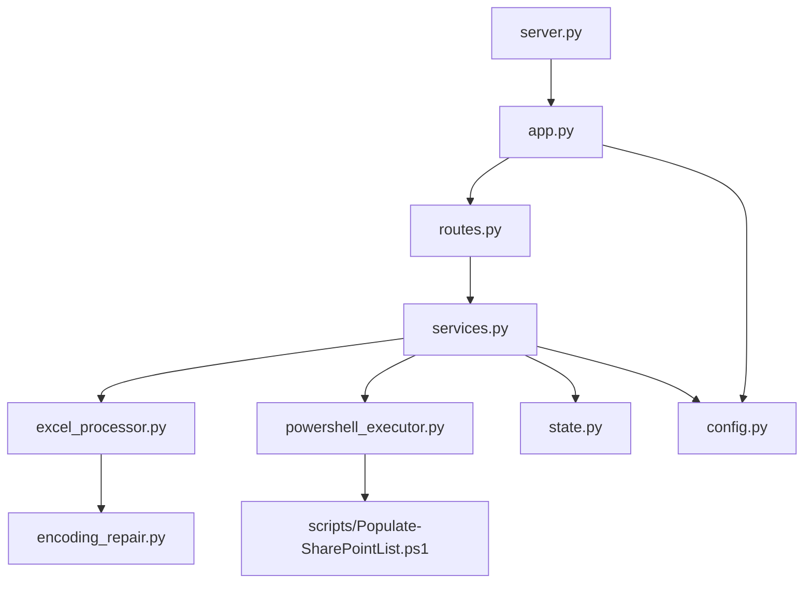

# Análise Estrutural e Extração de Entidades

## 1. Inventário de Arquivos

Ao iniciar a análise, construa um inventário completo:

```
INVENTÁRIO DE ARQUIVOS
├── [tipo: entrypoint]  server.py — Inicializa a aplicação Flask/FastAPI
├── [tipo: config]      config.py — Parâmetros globais da aplicação
├── [tipo: service]     services.py — Lógica de negócio principal
├── [tipo: route]       routes.py — Definição de endpoints HTTP
├── [tipo: util]        encoding_repair.py — Utilitário de codificação
└── [tipo: script]      scripts/Populate-SharePointList.ps1 — Automação externa
```

**Tipos de arquivo a classificar:**
- `entrypoint` — Ponto de entrada da aplicação
- `config` — Configurações e constantes
- `service` — Lógica de negócio
- `route` / `controller` — Camada de apresentação/API
- `model` / `schema` — Estruturas de dados
- `util` / `helper` — Funções auxiliares reutilizáveis
- `integration` — Comunicação com sistemas externos
- `script` — Automação e operações batch
- `test` — Testes automatizados

---

## 2. Extração de Entidades por Arquivo

Para cada arquivo, extraia e documente:

### Funções e Métodos

```
Nome:        process_excel_file(file_path: str, sheet_name: str = "Sheet1") -> dict
Visibilidade: pública
Retorno:     dict com chaves 'data', 'errors', 'metadata'
Propósito:   Lê e valida um arquivo Excel, retornando dados estruturados
Chamada por: services.py → handle_upload()
Chama:       encoding_repair.fix_encoding(), validate_schema()
```

### Classes

```
Nome:        ExcelProcessor
Herda de:    BaseProcessor
Padrão:      Strategy (implementa interface de processamento intercambiável)
Atributos:   self.config, self.logger, self.validators[]
Responsabilidade: Encapsula toda lógica de leitura, validação e transformação de Excel
```

### Constantes e Configurações

```
UPLOAD_FOLDER       = "backend/data/uploads"   # Diretório de uploads temporários
MAX_FILE_SIZE_MB    = 16                        # Limite de upload (Flask default)
ALLOWED_EXTENSIONS  = {'.xlsx', '.xls'}         # Formatos aceitos
```

---

## 3. Análise de Fluxo de Controle

Para funções com lógica complexa, mapeie o fluxo:

```
handle_upload(request)
│
├── [validação] arquivo presente? → erro 400 se não
├── [validação] extensão permitida? → erro 415 se não
├── [ação] salvar arquivo temporariamente
├── [processo] ExcelProcessor.process(file_path)
│   ├── [ação] detectar encoding
│   ├── [ação] reparar encoding se necessário
│   ├── [loop] para cada linha:
│   │   ├── [validação] schema válido?
│   │   └── [ação] adicionar a lista de resultados ou erros
│   └── [retorno] {'data': [...], 'errors': [...]}
├── [condição] tem erros críticos? → retornar relatório de erros
└── [ação] enviar dados para SharePoint via PowerShell
```

---

## 4. Detecção de Padrões e Anti-padrões

### Padrões a Reconhecer

| Padrão | Como Identificar |
|---|---|
| Layered Architecture | Separação clara: routes → services → data access |
| Repository Pattern | Classe isolada para acesso a dados |
| Service Layer | Classe de serviço sem acesso direto a HTTP |
| Facade | Módulo que simplifica uma subsistema complexo |
| Strategy | Interface com múltiplas implementações intercambiáveis |
| Factory | Função/classe que cria objetos de tipos variados |

### Anti-padrões a Detectar

| Anti-padrão | Sintoma |
|---|---|
| God Class | Classe com >500 linhas fazendo tudo |
| Magic Numbers | `if status == 3:` sem constante nomeada |
| Callback Hell | Funções aninhadas em mais de 3 níveis |
| Acoplamento Excessivo | Módulo importa de 8+ outros módulos |
| Falta de Tratamento de Erros | `except: pass` ou ausência de try/except |
| SQL Injection Risk | Concatenação de strings em queries |
| Secrets em Código | Credenciais hardcoded |

---

## 5. Mapa de Dependências

Produza um diagrama Mermaid ao final da análise:


