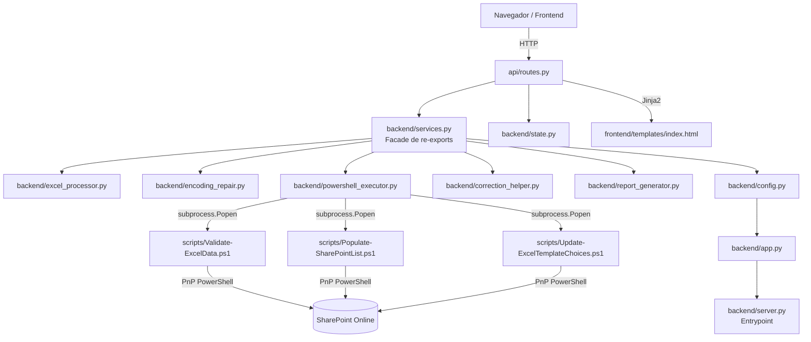
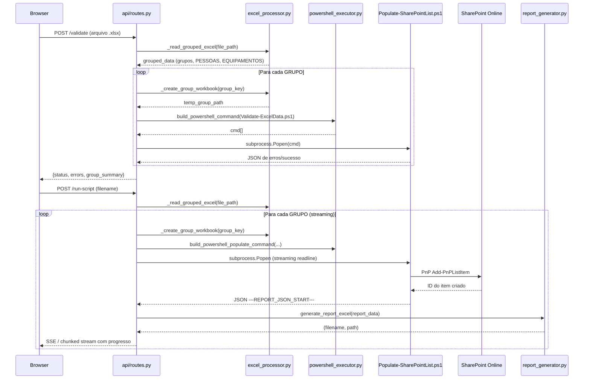

# Arquitetura do Sistema

## Visão Geral

O sistema segue uma **Arquitetura em Camadas** (Layered Architecture) com separação clara entre:

1. **Camada de Apresentação / API** (`api/routes.py`) — Recebe requisições HTTP, delega ao domínio
2. **Camada de Domínio / Serviços** (`backend/excel_processor.py`, `encoding_repair.py`, etc.) — Lógica de negócio pura
3. **Camada de Integração** (`backend/powershell_executor.py` + scripts `.ps1`) — Comunicação com SharePoint

A camada `backend/services.py` funciona como **Facade**, consolidando re-exports de todos os módulos para simplificar as importações em `api/routes.py`.

## Diagrama de Componentes



## Diagrama de Sequência — Fluxo Principal (Submissão)



## Camadas da Aplicação

### Camada de Apresentação (`api/routes.py`)
Responsável por:
- Receber e validar arquivos enviados pelo usuário
- Orquestrar chamadas aos módulos de domínio
- Invocar scripts PowerShell via `subprocess.Popen`
- Fazer streaming de progresso usando `Response(stream_with_context(...))`
- Retornar JSON estruturado com status, erros e referências a relatórios

### Camada de Domínio (módulos `backend/`)
Cada módulo tem responsabilidade única:

| Módulo | Responsabilidade |
|---|---|
| `excel_processor.py` | Leitura, agrupamento e criação de workbooks temporários |
| `encoding_repair.py` | Decodificação e reparo de texto com mojibake |
| `powershell_executor.py` | Construção de comandos PowerShell seguros |
| `correction_helper.py` | Validação de extensões e extração de opções de dropdown |
| `report_generator.py` | Geração de Excel formatado com paleta Vestas |
| `config.py` | Constantes de caminhos e controle de concorrência |
| `state.py` | Contador de jobs ativos (thread-safe) |

### Camada de Integração (scripts PowerShell)
| Script | Função |
|---|---|
| `Validate-ExcelData.ps1` | Valida dados Excel contra listas do SharePoint, retorna JSON |
| `Populate-SharePointList.ps1` | Insere itens no SharePoint, retorna relatório JSON |
| `Update-ExcelTemplateChoices.ps1` | Atualiza opções de dropdown no template Excel |

## Decisões de Design

| Decisão | Alternativa Considerada | Motivação |
|---|---|---|
| Scripts PowerShell para integração SharePoint | SDK Python para SharePoint | PnP PowerShell tem autenticação por certificado já configurada e é mais robusto para o ambiente Vestas |
| `services.py` como Facade de re-exports | Importar diretamente de cada módulo | Simplifica o `import` em `routes.py`; permite refatorar módulos internamente sem alterar `routes.py` |
| Streaming com `Response(stream_with_context)` | WebSockets ou polling | Mais simples de implementar com Flask puro; adequado para operações de duração moderada |
| Processamento por GRUPO (não arquivo todo) | Enviar arquivo completo ao PS1 | Permite rollback por grupo: se um falha, os anteriores já foram submetidos; feedback parcial ao usuário |
| Reparo de mojibake em Python | Forçar encoding no PS1 | Garante compatibilidade com PowerShell 5.1 em máquinas com locale variado |

## Padrão de Protocolo PS1 → Python

Os scripts PowerShell se comunicam com Python via **marcadores em stdout**:

```
# Para validação:
---VALIDATION_JSON_START---
{"status": "success", "errors": []}
---VALIDATION_JSON_END---

# Para submissão:
---REPORT_JSON_START---
{"id_mobilizacao": "MOB-123", "items": [...]}
---REPORT_JSON_END---

# Para progresso de grupo:
---GROUP_PROGRESS:1/3:NomeDoGrupo---
---GROUP_RESULT:{"status": "success", ...}---
---GROUP_SUMMARY_JSON_START---
{"groups": [...]}
---GROUP_SUMMARY_JSON_END---
```

Esta convenção de protocolo é a interface de contrato entre o Python e os scripts PowerShell.
