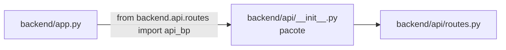

# `backend/api/__init__.py`

## Responsabilidade

> Marcador de pacote Python para o sub-módulo `backend.api`. Contém apenas a docstring do pacote.

## Localização

```
backend/api/__init__.py
```

## Conteúdo

```python
"""HTTP API layer for the Mobilization request app."""
```

Este arquivo declara o diretório `backend/api/` como um sub-pacote Python importável dentro do pacote `backend`. A docstring `"""HTTP API layer..."""` serve como descrição do pacote — visível em ferramentas como `help(backend.api)` e geradores de documentação automática.

**Por que é necessário?** Sem este arquivo, `from backend.api.routes import api_bp` em `backend/app.py` lançaria `ModuleNotFoundError`. O Python trata qualquer diretório com `__init__.py` como um pacote importável.

**Por que está vazio (apenas docstring)?** O pacote `api` não precisa exportar nada no nível do pacote — o único símbolo utilizado externamente é `api_bp`, importado diretamente de `backend.api.routes`. Inicializações em `__init__.py` seriam executadas a cada importação do pacote, o que seria desnecessário aqui.

**Por que `api/` está dentro de `backend/`?** Manter a API dentro do pacote `backend` garante que todos os imports internos usem o prefixo `backend.` de forma consistente (ex: `from backend.config import SCRIPTS_DIR` dentro de `routes.py`). Isso evita dependências cíclicas e elimina a necessidade de manipular `sys.path` ou `PYTHONPATH`.

## Interações com Outros Módulos


