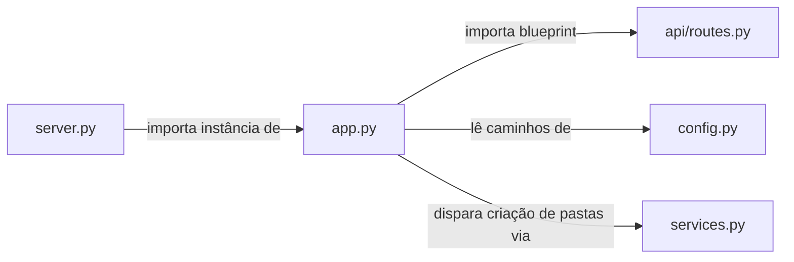

# `backend/app.py`

## Responsabilidade

> Fábrica da instância Flask. Monta toda a aplicação: configura pastas, define encoding JSON, registra blueprints.

`app.py` implementa o padrão **Application Factory** do Flask: centraliza toda a configuração da instância em um único lugar, de forma que `server.py` apenas importe e execute, e testes poderiam criar instâncias isoladas.

## Localização

```
backend/app.py
```

## Dependências

### Internas
| Módulo | Por quê é importado |
|---|---|
| `api.routes.api_bp` | Blueprint com todos os endpoints da API |
| `backend.config` | `FRONTEND_STATIC_DIR`, `FRONTEND_TEMPLATES_DIR` — caminhos absolutos das pastas do frontend |
| `backend.services` | `REPORTS_FOLDER`, `UPLOAD_FOLDER` — pastas de dados; importar aqui força a criação das pastas via `os.makedirs` em `config.py` |

### Externas
| Biblioteca | Propósito |
|---|---|
| `flask.Flask` | Criação da instância da aplicação web |

---

## Código Completo e Análise

```python
from flask import Flask

from api.routes import api_bp
from backend.config import FRONTEND_STATIC_DIR, FRONTEND_TEMPLATES_DIR
from backend.services import REPORTS_FOLDER, UPLOAD_FOLDER

app = Flask(
    __name__,
    template_folder=str(FRONTEND_TEMPLATES_DIR),
    static_folder=str(FRONTEND_STATIC_DIR),
)
app.json.ensure_ascii = False
app.config['UPLOAD_FOLDER'] = UPLOAD_FOLDER
app.config['REPORTS_FOLDER'] = REPORTS_FOLDER
app.register_blueprint(api_bp)
```

### Análise de cada configuração

**`Flask(__name__, template_folder=..., static_folder=...)`**

Por padrão, o Flask procura templates e estáticos em subpastas do diretório onde `app.py` reside (`backend/`). Como o frontend está em `frontend/`, é necessário sobrescrever explicitamente esses caminhos usando os `Path` objects calculados em `config.py`.

**`app.json.ensure_ascii = False`**

Por padrão, o Flask serializa caracteres não-ASCII como sequências de escape Unicode (`\u00e3` em vez de `ã`). Desabilitar isso é essencial porque:
- O sistema lida com nomes em português com acentos
- O frontend exibiria escape codes em vez de texto legível
- Mensagens de erro e nomes de mobilizações seriam ilegíveis

**`app.config['UPLOAD_FOLDER'] = UPLOAD_FOLDER`**
**`app.config['REPORTS_FOLDER'] = REPORTS_FOLDER`**

Registrar os caminhos no `app.config` permite que os blueprints os acessem via `current_app.config[...]` sem importar diretamente de `config.py`. Isso desacopla os endpoints da configuração estática e segue o padrão Flask de injeção de configuração.

**`app.register_blueprint(api_bp)`**

Registra o blueprint `api_bp` definido em `api/routes.py`. Sem prefixo de URL, o que significa que as rotas do blueprint são montadas diretamente na raiz (`/`, `/validate`, `/run-script`, etc.).

**Por que importar `REPORTS_FOLDER` e `UPLOAD_FOLDER` de `services.py` e não de `config.py`?**

`config.py` define os caminhos e também executa `os.makedirs(folder, exist_ok=True)` no nível de módulo para cada pasta. Ao importar de `services.py`, que por sua vez importa de `config.py`, o efeito colateral de criação de diretórios é disparado no momento da importação — garantindo que as pastas existam antes de qualquer requisição ser processada.

---

## Interações com Outros Módulos


