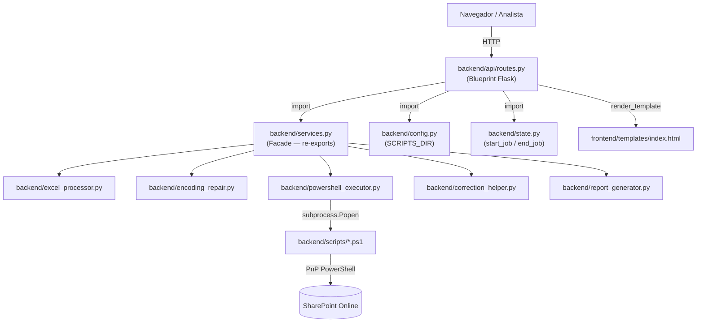
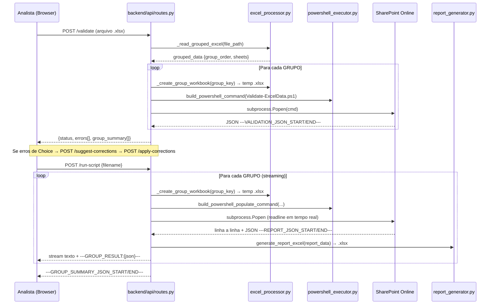

# `backend/api/` — Camada HTTP da Aplicação

## Visão Geral

O diretório `backend/api/` é o **sub-pacote de apresentação** do sistema. Ele agrupa exclusivamente os componentes que lidam com a interface HTTP: definição de rotas, recebimento de requisições, orquestração de fluxo e envio de respostas.

```
backend/
└── api/
    ├── __init__.py      ← Declara o pacote Python (backend.api)
    └── routes.py        ← Blueprint Flask com todos os endpoints
```

> **Decisão arquitetural**: Ao manter `api/` **dentro de** `backend/`, todo o código do servidor forma um único pacote Python instalável (`backend`). Imports internos usam o prefixo `backend.` de forma consistente — ex: `from backend.config import SCRIPTS_DIR` — sem necessidade de manipular `sys.path` ou `PYTHONPATH`.

---

## Arquivos do Pacote

### [`__init__.py`](./api-init.md)

Marcador de pacote Python. Contém apenas a docstring `"""HTTP API layer for the Mobilization request app."""`. Não exporta símbolos — o único símbolo útil do pacote, `api_bp`, é importado diretamente de `backend.api.routes`.

### [`routes.py`](./routes.md)

Blueprint Flask com **9 endpoints HTTP** cobrindo todo o ciclo de vida de uma solicitação de mobilização:

| Método | Rota | Propósito |
|---|---|---|
| `GET` | `/` | Serve o frontend SPA (index.html via Jinja2) |
| `GET` | `/download-template` | Download do modelo Excel para preenchimento |
| `GET` | `/template-update-status` | Consulta data/hora da última atualização do template |
| `POST` | `/update-template` | Executa PS1 para atualizar dropdowns do template via SharePoint |
| `POST` | `/validate` | Fase 1: valida estrutura e dados Excel por grupo antes da importação |
| `POST` | `/run-script` | Fase 2: importa dados ao SharePoint via streaming (grupo a grupo) |
| `POST` | `/shutdown` | Encerra o servidor Flask (uso administrativo) |
| `GET` | `/list-reports` | Lista relatórios Excel gerados, ordenados por data |
| `GET` | `/download-report/<filename>` | Download de relatório com proteção contra path traversal |
| `POST` | `/suggest-corrections` | Sugere correções para erros de choice field via fuzzy matching |
| `POST` | `/apply-corrections` | Aplica correções selecionadas diretamente no arquivo Excel salvo |

---

## Posição na Arquitetura



O pacote `backend/api/` é o **único ponto de entrada HTTP** da aplicação. Toda lógica de negócio vive nos módulos `backend/`, acessados através do Facade `services.py`.

---

## Padrões Utilizados

| Padrão | Onde | Descrição |
|---|---|---|
| **Blueprint (Flask)** | `routes.py` | Modulariza as rotas sem criar uma aplicação Flask separada; permite registrar no app com `app.register_blueprint(api_bp)` |
| **Facade** | `services.py` (importado por `routes.py`) | Centraliza re-exports dos módulos de domínio; isola `routes.py` de mudanças internas nos módulos |
| **Streaming Response** | `/run-script` | `Response(stream_with_context(generate()))` permite envio progressivo de texto ao browser sem buffer |
| **Job Counter (Thread-safe)** | `state.py` via `start_job/end_job` | Conta operações ativas com `threading.Lock` para evitar condições de corrida |

---

## Fluxo Completo de Submissão



---

## Protocolo de Comunicação Python ↔ PowerShell

Os scripts `.ps1` comunicam resultados via **marcadores delimitadores em stdout**:

```
# Resultado de validação (Validate-ExcelData.ps1):
---VALIDATION_JSON_START---
{"status": "success", "errors": []}
---VALIDATION_JSON_END---

# Relatório de submissão (Populate-SharePointList.ps1):
---REPORT_JSON_START---
{"id_mobilizacao": "MOB-20241115-001", "requester_name": "...", "items": [...]}
---REPORT_JSON_END---

# Progresso de grupo (emitido em tempo real):
---GROUP_PROGRESS:1/3:NomeDoGrupo---
---GROUP_RESULT:{"id_mobilizacao": "...", "status": "success", "qtd_pessoas": 5, "qtd_equipamentos": 2}---
---GROUP_SUMMARY_JSON_START---
{"groups": [...]}
---GROUP_SUMMARY_JSON_END---
```

Este protocolo é o **contrato de interface** entre a camada Python e os scripts PowerShell. Mudanças nos marcadores quebram a integração em ambas as direções.

---

## Segurança

| Vetor | Mitigação |
|---|---|
| Path traversal em `/download-report/<filename>` | `secure_filename()` + verificação `file_abs.startswith(reports_abs + os.sep)` |
| Upload de arquivo malicioso | Validação de extensão (`allowed_file()`) + verificação de tamanho zero |
| Injeção de comando via nomes de arquivo/aba | `escape()` de aspas simples em todos os parâmetros antes de interpolar no comando PowerShell |
| Nomes de arquivo inseguros | `werkzeug.utils.secure_filename` em todos os uploads e downloads |

> **Risco em aberto**: Nenhum endpoint possui autenticação. `POST /shutdown` aceita requisições de qualquer IP na rede. Ver [improvements.md](../improvements.md#3-ausência-de-autenticação-nos-endpoints) para detalhes.
