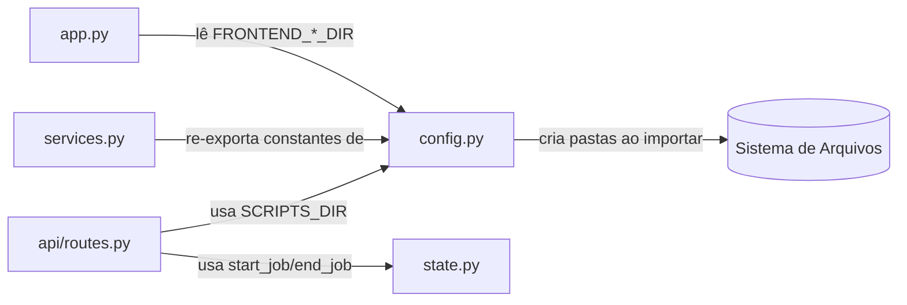

# `backend/config.py`

## Responsabilidade

> Módulo de configuração central. Define todos os caminhos de diretório, constantes globais, e fornece um mecanismo thread-safe de contagem de jobs ativos.

Este módulo serve dois propósitos que poderiam estar separados, mas foram colocados juntos por conveniência: (1) constantes de infraestrutura e (2) controle de concorrência de jobs. A duplicação com `state.py` é uma dívida técnica identificável.

## Localização

```
backend/config.py
```

## Dependências

### Externas
| Biblioteca | Propósito |
|---|---|
| `pathlib.Path` | Manipulação de caminhos multiplataforma |
| `os` | `os.makedirs`, `os.path.join` para operações de sistema de arquivos |
| `threading` | `threading.Lock` para proteção de acesso ao contador de jobs |

---

## Constantes de Caminho

```python
BASE_DIR = Path(__file__).resolve().parent.parent
```

**Por que `.parent.parent`?** `__file__` é `backend/config.py`. `.parent` é `backend/`. `.parent.parent` é a raiz do projeto. Usar `Path(__file__).resolve()` garante que funciona independentemente do diretório de trabalho atual (CWD) ao executar o servidor.

```python
FRONTEND_DIR         = BASE_DIR / "frontend"
FRONTEND_TEMPLATES_DIR = FRONTEND_DIR / "templates"
FRONTEND_STATIC_DIR  = FRONTEND_DIR / "static"

BACKEND_DIR  = BASE_DIR / "backend"
DATA_DIR     = BACKEND_DIR / "data"
SCRIPTS_DIR  = BACKEND_DIR / "scripts"
```

A hierarquia de `Path` objects usa o operador `/` do `pathlib` para concatenar segmentos de caminho de forma multiplataforma (funciona em Windows e Linux sem ajuste).

```python
UPLOAD_FOLDER    = os.path.join(str(DATA_DIR), "templates")
REPORTS_FOLDER   = os.path.join(str(DATA_DIR), "uploads")
TEMPLATE_FILENAME = "ModeloSolicitacaoMob.xlsx"
TEMPLATE_STATUS_FILE = os.path.join(UPLOAD_FOLDER, "template_update_status.json")
ALLOWED_EXTENSIONS = {"xlsx"}
```

| Constante | Valor Resolvido | Propósito |
|---|---|---|
| `UPLOAD_FOLDER` | `backend/data/templates/` | Onde o template Excel e uploads temporários são armazenados |
| `REPORTS_FOLDER` | `backend/data/uploads/` | Onde relatórios gerados e workbooks temporários de grupo são salvos |
| `TEMPLATE_FILENAME` | `ModeloSolicitacaoMob.xlsx` | Nome do arquivo de template baixável pelo usuário |
| `TEMPLATE_STATUS_FILE` | `backend/data/templates/template_update_status.json` | JSON com data da última atualização do template |
| `ALLOWED_EXTENSIONS` | `{"xlsx"}` | Apenas arquivos Excel modernos são aceitos |

> **Atenção**: Os nomes `UPLOAD_FOLDER` e `REPORTS_FOLDER` são contraintuitivos. `UPLOAD_FOLDER` armazena o *template* (não uploads do usuário), e `REPORTS_FOLDER` armazena tanto os uploads quanto os relatórios. Isso é uma dívida técnica de nomenclatura.

### Efeito Colateral na Importação

```python
for folder in (UPLOAD_FOLDER, REPORTS_FOLDER, ...):
    os.makedirs(folder, exist_ok=True)
```

Ao importar `config.py`, os diretórios são criados automaticamente se não existirem. Isso é um **efeito colateral intencional**: garante que a aplicação nunca falhe por falta de diretórios, sem necessidade de verificação explícita em cada módulo.

---

## Controle de Jobs Ativos

```python
ACTIVE_JOBS = 0
JOBS_LOCK = threading.Lock()
```

Variável global + mutex para contar operações longas em execução (validação e submissão). O propósito é permitir que o sistema saiba se há processamento em andamento (ex: bloquear shutdown).

### `start_job() -> None`

```python
def start_job() -> None:
    global ACTIVE_JOBS
    with JOBS_LOCK:
        ACTIVE_JOBS += 1
```

**Propósito**: Registra início de um job longo. Chamada ao início de cada endpoint que invoca PowerShell.

**Por que `with JOBS_LOCK`**: O Flask executa requisições em threads separadas (`threaded=True`). Sem o lock, múltiplas threads poderiam ler/incrementar `ACTIVE_JOBS` simultaneamente, causando race condition (o valor final seria menor que o esperado).

### `end_job() -> None`

```python
def end_job() -> None:
    global ACTIVE_JOBS
    with JOBS_LOCK:
        if ACTIVE_JOBS > 0:
            ACTIVE_JOBS -= 1
```

**Por que `if ACTIVE_JOBS > 0`**: Proteção defensiva. Se `end_job()` for chamado mais vezes que `start_job()` (ex: por bug ou exceção não tratada), o contador não vai para negativo — um negativo seria pior que zero para qualquer verificação de estado.

### `get_active_jobs() -> int`

```python
def get_active_jobs() -> int:
    with JOBS_LOCK:
        return ACTIVE_JOBS
```

Leitura thread-safe do contador. O lock é necessário mesmo para leitura, pois em Python o `+=` não é atômico.

> **Dívida técnica**: `state.py` define as mesmas funções e variáveis. `config.py` duplica essa funcionalidade. Ver [improvements.md](../improvements.md).

---

## Interações com Outros Módulos


