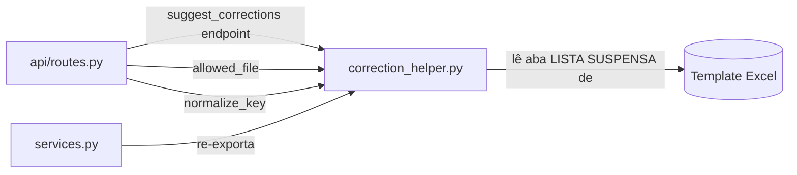

# `backend/correction_helper.py`

## Responsabilidade

> Módulo de validação e sugestão de correções. Normaliza texto para comparação, extrai opções de dropdown da aba oculta do Excel, e valida extensões de arquivo.

## Localização

```
backend/correction_helper.py
```

## Dependências

### Externas
| Biblioteca | Propósito |
|---|---|
| `openpyxl` | Leitura da aba oculta `LISTA SUSPENSA` do template Excel |
| `re` | Extração de nome interno entre colchetes no cabeçalho |
| `unicodedata` | Normalização NFD para remoção de acentos |

---

## Funções

### `normalize_key(text: str) -> str`

**Propósito**: Normaliza texto para comparação tolerante a acentos, capitalização e espaços extras.

```python
def normalize_key(text: str) -> str:
    if not text:
        return ''
    nfd = unicodedata.normalize('NFD', str(text).strip().lower())
    return ''.join(c for c in nfd if unicodedata.category(c) != 'Mn')
```

**Como funciona**:
1. `.strip().lower()` — remove espaços e converte para minúsculas
2. `unicodedata.normalize('NFD', ...)` — decompõe caracteres acentuados em caractere base + diacrítico (ex: `ã` → `a` + diacrítico `~`)
3. `unicodedata.category(c) != 'Mn'` — remove os diacríticos (categoria `Mn` = Mark, Nonspacing)

**Resultado**: `"Função"` → `"funcao"`, `"MOBILIZAÇÃO"` → `"mobilizacao"`

**Por que esta abordagem?** Os nomes de campos no Excel podem ter capitalização inconsistente e os erros de Choice retornados pelo SharePoint usam o nome interno do campo. A normalização garante que `"Função de Pessoa"` case com `"funcao de pessoa"` independente de como foi digitado.

---

### `extract_lista_suspensa_columns(file_path: str) -> list`

**Propósito**: Lê a aba oculta `LISTA SUSPENSA` (ou `DROPDOWN`) do template Excel e extrai as opções válidas de cada coluna de dropdown.

**Retorno**: Lista de dicionários no formato:
```python
[
    {
        'column_name': 'Função de Pessoa',       # Nome de exibição (para o usuário)
        'internal_name': 'FuncaoPessoa',          # Nome interno do campo no SharePoint
        'options': ['Eletricista', 'Mecânico', ...]
    },
    ...
]
```

**Formato do cabeçalho na aba `LISTA SUSPENSA`**:
```
Função de Pessoa [FuncaoPessoa]
```

A regex extrai nome de exibição e nome interno:
```python
m = re.match(r'^(?P<disp>.+?)\s*\[(?P<internal>[^\[\]]+)\]\s*$', header)
```

Se o cabeçalho não tem colchetes, `display_name == internal_name`.

**Detecção de nomes de aba**:
```python
for name in wb.sheetnames:
    if normalize_key(name) in ('lista suspensa', 'lista_suspensa', 'listasuspensa', 'dropdown'):
```

Aceita variações de nome da aba (com/sem espaço, com underscore, em inglês), usando `normalize_key()` para comparação tolerante.

**Por que a aba é "oculta"?** O template Excel tem uma aba `LISTA SUSPENSA` que o analista não precisa ver ou editar — ela serve apenas como referência de dados para validação do lado Python. A aba pode estar oculta no Excel (via `tab.hidden = True`) mas `openpyxl` a lê normalmente.

**Tratamento de erros**: Toda a função está dentro de `try/except Exception: pass`. Falha silenciosa — retorna lista vazia. Isso é apropriado porque a funcionalidade de sugestão de correções é não-crítica: se não conseguir ler as opções, simplesmente não sugere correções.

---

### `allowed_file(filename: str, allowed_extensions: set = None) -> bool`

**Propósito**: Verifica se um filename tem extensão permitida.

```python
def allowed_file(filename: str, allowed_extensions: set = None) -> bool:
    if allowed_extensions is None:
        allowed_extensions = {'xlsx'}
    return '.' in filename and filename.rsplit('.', 1)[1].lower() in allowed_extensions
```

**`rsplit('.', 1)`**: Divide o filename em no máximo 2 partes a partir do último ponto. Isso garante que `arquivo.malicioso.xlsx` seja reconhecido como tendo extensão `xlsx` (não `malicioso.xlsx`). Porém, o `secure_filename()` do Werkzeug sanitiza o nome antes desta verificação em `routes.py`.

**Por que `lower()`?** Garante que `arquivo.XLSX` e `arquivo.xlsx` sejam igualmente aceitos — usuários Windows frequentemente têm extensões em maiúsculas.

---

## Interações com Outros Módulos



## Uso no Endpoint `/suggest-corrections`

Este módulo é o núcleo do endpoint `POST /suggest-corrections` em `routes.py`, que:
1. Recebe uma lista de `{campo, valor}` com erros de Choice retornados pelo SharePoint
2. Chama `extract_lista_suspensa_columns()` para obter as opções válidas
3. Para cada erro, usa `normalize_key()` para encontrar a coluna correspondente
4. Retorna as opções válidas da coluna como sugestões ao frontend

Isso permite que o analista veja exatamente quais valores são aceitos e corrija o Excel antes de reenviar.
