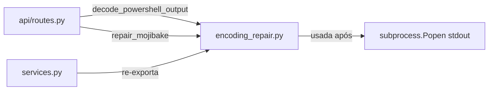

# `backend/encoding_repair.py`

## Responsabilidade

> Utilitário de decodificação e reparo de mojibake em saída do PowerShell 5.1 no Windows.

Este módulo resolve um problema específico e não-trivial: o PowerShell 5.1 no Windows pode emitir texto em codificações diferentes dependendo do locale da máquina. Texto em português com acentos frequentemente sai como **mojibake** (ex: `ç£o` em vez de `ação`). O módulo implementa uma estratégia de decodificação competitiva para escolher a melhor interpretação.

## Localização

```
backend/encoding_repair.py
```

## Dependências

### Externas
| Biblioteca | Propósito |
|---|---|
| `re` | Divisão de texto por espaços para processamento palavra a palavra |
| `unicodedata` | Detecção de categorias de caracteres (não usado diretamente aqui, mas importado) |

---

## O Problema: Mojibake em PowerShell 5.1

No Windows, o PowerShell 5.1 usa por padrão a codificação da página de código do sistema (geralmente `cp1252` em máquinas brasileiras). Quando texto UTF-8 é emitido e lido como `cp1252`, ou vice-versa, os bytes são mal interpretados:

```
Esperado:  "Mobilização concluída"
Recebido:  "Mobilização concluída"   ← UTF-8 bytes lidos como cp1252
```

O módulo tenta ambas as decodificações e escolhe a de melhor qualidade via pontuação.

> **Nota**: Os scripts PowerShell já forçam UTF-8 via `[Console]::OutputEncoding = [System.Text.UTF8Encoding]::new($false)` (definido em `powershell_executor.py`). Este módulo é a segunda linha de defesa para máquinas com configurações não-padrão.

---

## Funções

### `decode_powershell_output(raw_output: bytes) -> str`

**Propósito**: Ponto de entrada principal. Recebe bytes brutos do stdout do PowerShell e retorna a string mais legível possível.

```python
def decode_powershell_output(raw_output: bytes) -> str:
    utf8_text = raw_output.decode('utf-8', errors='replace')
    cp1252_text = raw_output.decode('cp1252', errors='replace')
    repaired_cp1252 = repair_mojibake(cp1252_text)

    utf8_score = score_decoded_text(utf8_text)
    repaired_cp1252_score = score_decoded_text(repaired_cp1252)

    if repaired_cp1252_score < utf8_score:
        return repaired_cp1252
    return utf8_text
```

**Estratégia (decodificação competitiva)**:
1. Decodificar bytes como UTF-8 → `utf8_text`
2. Decodificar bytes como cp1252 → `cp1252_text`
3. Tentar reparar mojibake em `cp1252_text` → `repaired_cp1252`
4. Pontuar ambos com `score_decoded_text()` (menor score = melhor)
5. Retornar o de menor pontuação (menos artefatos)

**Por que `errors='replace'`?** Em vez de lançar `UnicodeDecodeError` (que quebraria o streaming), substitui bytes inválidos pelo caractere `\ufffd` (replacement character `?`). O score penaliza esse caractere, incentivando a escolha da decodificação correta.

---

### `repair_mojibake(text: str) -> str`

**Propósito**: Itera até 3 vezes tentando reparar mojibake, parando quando o reparo piora a qualidade.

```python
def repair_mojibake(text: str) -> str:
    previous_text = text
    for _ in range(3):
        repaired_text = repair_mojibake_once(previous_text)
        if score_decoded_text(repaired_text) >= score_decoded_text(previous_text):
            return previous_text
        previous_text = repaired_text
    return previous_text
```

**Por que no máximo 3 iterações?** Mojibake duplo (texto codificado duas vezes incorretamente) pode requerer múltiplos passes de reparo. O limite de 3 previne loops infinitos e garante performance.

**Por que parar se o score piorar?** O reparo é melhor-esforço. Se após uma iteração o texto ficou *pior* (mais caracteres problemáticos), o reparo está amplificando o erro — para e retorna o melhor encontrado até o momento.

---

### `repair_mojibake_once(text: str) -> str`

**Propósito**: Uma passagem de reparo — para cada palavra do texto, tenta reverter a má interpretação cp1252→utf8.

```python
def repair_mojibake_once(text: str) -> str:
    parts = re.split(r'(\s+)', text)
    for part in parts:
        if not has_mojibake_markers(part):
            # Palavra sem marcadores → deixar intacta
            repaired_parts.append(part)
            continue
        try:
            repaired_candidate = part.encode('cp1252').decode('utf-8')
        except (UnicodeEncodeError, UnicodeDecodeError):
            repaired_parts.append(part)  # Não conseguiu reparar → manter original
            continue
        # Usar o candidato reparado apenas se melhorar o score
        if score_decoded_text(repaired_candidate) <= score_decoded_text(part):
            repaired_parts.append(repaired_candidate)
        else:
            repaired_parts.append(part)
```

**A operação de reparo**: `part.encode('cp1252').decode('utf-8')` é a operação inversa do erro original:
- O erro original foi: bytes UTF-8 foram decodificados como cp1252
- O reparo reverte: re-codifica como cp1252 (obtendo os bytes UTF-8 originais) e decodifica como UTF-8

**Por que palavra a palavra?** Textos reais frequentemente têm mistura de texto correto e mojibake na mesma linha (ex: `"Grupo VESTAS ç£o"`). Processar palavra a palavra permite corrigir apenas os segmentos problemáticos sem afetar o que já está correto.

**Por que `re.split(r'(\s+)', text)` com grupo de captura?** O grupo `(\s+)` inclui os espaços/quebras de linha na lista de partes, então ao fazer `''.join(repaired_parts)` a formatação original é preservada.

---

### `has_mojibake_markers(text: str) -> bool`

**Propósito**: Verificação rápida se uma palavra contém os caracteres mais comuns de mojibake UTF-8→cp1252 em português.

```python
return any(marker in text for marker in ('Ã', 'Â', 'â'))
```

**Por que esses caracteres?** São os primeiros bytes de sequências UTF-8 multi-byte para caracteres acentuados portugueses, quando interpretados como cp1252:
- `ã` (U+00E3) em UTF-8 = bytes `0xC3 0xA3` → lidos como cp1252 = `ã`
- `ç` (U+00E7) em UTF-8 = bytes `0xC3 0xA7` → lidos como cp1252 = `ç`
- `â` (U+00E2) em UTF-8 = bytes `0xC3 0xA2` → lidos como cp1252 = `â`

---

### `score_decoded_text(text: str) -> int`

**Propósito**: Função de custo — quanto menor o valor, melhor a qualidade da decodificação.

```python
def score_decoded_text(text: str) -> int:
    replacement_penalty = text.count('?') * 10  # Caracteres não-decodificáveis
    mojibake_penalty = sum(text.count(m) for m in ('Ã', 'Â', 'â')) * 6
    return replacement_penalty + mojibake_penalty
```

**Pesos das penalidades**:
| Artefato | Penalidade | Justificativa |
|---|---|---|
| `?` (replacement char) | 10 por ocorrência | Indica bytes completamente indecodificáveis — problema mais grave |
| `Ã`, `Â`, `â` (mojibake markers) | 6 por ocorrência | Indicam texto mal codificado — problema moderado, potencialmente reparável |

---

## Interações com Outros Módulos


