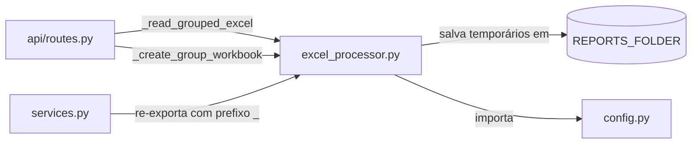

# `backend/excel_processor.py`

## Responsabilidade

> Módulo de processamento de Excel. Lê, valida estrutura, agrupa por GRUPO e cria workbooks temporários para processamento isolado por grupo.

Este módulo encapsula toda a lógica de manipulação de arquivos `.xlsx` usando `openpyxl`. Ele implementa o **padrão de processamento por grupo**, que é a unidade fundamental de trabalho do sistema: cada `GRUPO` representa uma solicitação de mobilização independente.

## Localização

```
backend/excel_processor.py
```

## Dependências

### Internas
| Módulo | Por quê |
|---|---|
| `backend.config.REPORTS_FOLDER` | Diretório onde workbooks temporários de grupo são salvos |

### Externas
| Biblioteca | Propósito |
|---|---|
| `openpyxl` | Leitura e escrita de arquivos `.xlsx` |
| `os`, `tempfile` | Criação de arquivos temporários com caminho único |

---

## Funções

### `read_grouped_excel(file_path: str) -> tuple[dict | None, list[str]]`

**Propósito**: Lê as abas `PESSOAS` e `EQUIPAMENTOS` do arquivo Excel, valida a estrutura obrigatória (coluna A = `GRUPO`), detecta duplicatas dentro de grupos e organiza os dados em um dicionário indexado por grupo.

**Retorno**: `(data, errors)`
- `data`: dicionário com a estrutura abaixo, ou `None` se houve erros
- `errors`: lista de strings descrevendo os problemas encontrados

**Estrutura do `data` retornado**:
```python
{
    'group_order': ['GRUPO-A', 'GRUPO-B'],   # Ordem de aparição no Excel
    'sheets': {
        'PESSOAS': {
            'headers': ['GRUPO', 'Nome', 'Cargo', ...],
            'rows': [{'excel_row': 2, 'group': 'GRUPO-A', 'values': [...]}],
            'rows_by_group': {
                'GRUPO-A': [{'excel_row': 2, 'group': 'GRUPO-A', 'values': [...]}]
            }
        },
        'EQUIPAMENTOS': { ... }   # Mesma estrutura
    }
}
```

**Fluxo de execução**:

```mermaid
flowchart TD
    A[Abrir workbook com openpyxl] --> B{Abas PESSOAS e EQUIPAMENTOS existem?}
    B -->|Não| C[Retornar erros de aba ausente]
    B -->|Sim| D[Para cada aba]
    D --> E{Cabeçalho A1 == 'GRUPO'?}
    E -->|Não| F[Adicionar erro de cabeçalho]
    E -->|Sim| G[Para cada linha a partir da linha 2]
    G --> H{Linha tem dados?}
    H -->|Não| I[Pular linha vazia]
    H -->|Sim| J{GRUPO vazio?}
    J -->|Sim| K[Adicionar erro de GRUPO vazio]
    J -->|Não| L{Linha duplicada no grupo?}
    L -->|Sim| M[Adicionar erro de duplicata]
    L -->|Não| N[Adicionar ao rows e rows_by_group]
    N --> O{Grupo já visto?}
    O -->|Não| P[Adicionar a group_order]
    O -->|Sim| Q[Continuar]
    P --> G
    Q --> G
    G -->|Todas as linhas processadas| R{Há erros?}
    R -->|Sim| S[Retornar None, errors]
    R -->|Não| T{group_order vazio?}
    T -->|Sim| U[Retornar erro de arquivo vazio]
    T -->|Não| V[Retornar data, []]
```

**Detecção de duplicatas**:
```python
signature = tuple(value_to_exact_text(v) for v in row_values)
duplicate_bucket = duplicate_keys.setdefault(group_key, set())
if signature in duplicate_bucket:
    errors.append(...)
```

A assinatura de uma linha é a tupla com *todos* os valores convertidos para string. Se duas linhas têm exatamente os mesmos valores no mesmo grupo, são consideradas duplicatas. A detecção é **intra-grupo**: a mesma linha pode aparecer em grupos diferentes sem erro.

**Importante**: O `wb.close()` é chamado no bloco `finally` para garantir liberação do arquivo mesmo em caso de exceção — crítico no Windows, onde arquivos abertos não podem ser excluídos.

---

### `create_group_workbook(source_data: dict, group_key: str) -> str`

**Propósito**: A partir dos dados agrupados em memória, cria um arquivo `.xlsx` temporário contendo **apenas as linhas do grupo especificado**, com cabeçalhos de ambas as abas preservados.

**Por que criar um arquivo temporário por grupo?** Os scripts PowerShell (`Validate-ExcelData.ps1`, `Populate-SharePointList.ps1`) recebem um arquivo Excel como parâmetro. Enviar o arquivo completo para cada grupo seria ineficiente e poderia causar processamento errado. O isolamento por grupo permite que cada execução PowerShell seja independente e atômica.

**Parâmetros**:
| Nome | Tipo | Descrição |
|---|---|---|
| `source_data` | `dict` | Resultado de `read_grouped_excel()` |
| `group_key` | `str` | Nome do grupo a extrair |

**Retorno**: `str` — Caminho absoluto do arquivo temporário criado em `REPORTS_FOLDER`

```python
temp_fd, temp_path = tempfile.mkstemp(
    prefix='mob_group_',
    suffix='.xlsx',
    dir=REPORTS_FOLDER
)
os.close(temp_fd)
```

**Por que `tempfile.mkstemp` + `os.close`?** `mkstemp` cria o arquivo e retorna um file descriptor aberto. O `os.close(temp_fd)` fecha o descriptor antes de o openpyxl abrir o arquivo para escrita. Se o FD não fosse fechado, ocorreria erro de "arquivo já aberto" no Windows.

**Ciclo de vida do arquivo**: O arquivo temporário é criado aqui, usado pelo `subprocess.Popen` e **removido pelo chamador** (em `routes.py`, bloco `finally`). `excel_processor.py` não tem responsabilidade de limpeza — é deliberado: o chamador controla quando o arquivo não é mais necessário.

---

### `count_excel_rows(file_path: str, sheet_name: str) -> int`

**Propósito**: Conta linhas com dados (excluindo o cabeçalho) em uma aba específica.

**Por que `read_only=True`?** Performance. `openpyxl` em modo `read_only` não carrega formatação nem fórmulas, apenas os valores — muito mais rápido para arquivos grandes.

**Tratamento de erro**: Retorna `0` em caso de qualquer falha (arquivo não encontrado, aba inexistente). O chamador deve verificar se `0` é um resultado válido ou problemático.

---

### `value_to_exact_text(value) -> str`

**Propósito**: Normalização mínima — converte qualquer valor de célula para string sem modificação do conteúdo.

```python
def value_to_exact_text(value) -> str:
    if value is None:
        return ''
    return str(value)
```

**Por que não normalizar (remover acentos, lowercase)?** Os valores serão enviados ao SharePoint exatamente como aparecem no Excel. Qualquer normalização poderia criar incompatibilidade com as opções de Choice do SharePoint. A comparação normalizada, quando necessária, é responsabilidade de `correction_helper.normalize_key()`.

---

### `row_has_any_data(values: list) -> bool`

**Propósito**: Verifica se ao menos uma célula da linha tem conteúdo não-vazio.

**Por que é necessário?** `openpyxl` pode reportar `ws.max_row` incluindo linhas com formatação mas sem dados. Esta função garante que apenas linhas com conteúdo real sejam processadas.

---

## Interações com Outros Módulos


