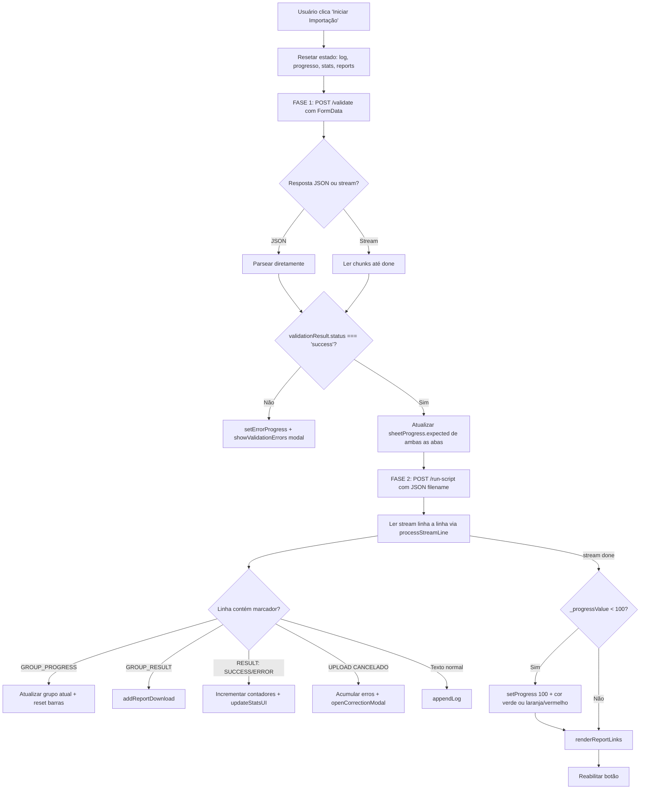

# `frontend/templates/index.html`

## Responsabilidade

> Single-page application (SPA) completo — HTML, CSS e JavaScript em um único arquivo. Implementa toda a interface do usuário para upload, validação, submissão em streaming, correção guiada e download de relatórios.

Este arquivo é a **totalidade do frontend**. Não há bundler, transpilador ou framework JS — é vanilla JavaScript ES2020+ servido diretamente pelo Flask via Jinja2. A escolha de um único arquivo com tudo inline é intencional: simplicidade de deploy, sem dependências de build.

## Localização

```
frontend/templates/index.html
```

## Stack Frontend

| Tecnologia | Versão | Entrega | Propósito |
|---|---|---|---|
| Bootstrap 5 | 5.3.0 | CDN (jsDelivr) | Grid, componentes (Modal, Offcanvas, Progress) |
| Bootstrap JS Bundle | 5.3.0 | CDN (jsDelivr) | Comportamento interativo (inclui Popper) |
| Vanilla JavaScript | ES2020+ | Inline `<script>` | Toda a lógica da aplicação |
| CSS Custom Properties | — | Inline `<style>` | Design tokens da identidade Vestas |

> **Nota de segurança**: As CDNs usam `cdn.jsdelivr.net` sem verificação de integridade (`integrity` attribute ausente). Um ataque à CDN poderia injetar código malicioso. Recomenda-se adicionar `integrity` e `crossorigin` attributes.

---

## Arquitetura do Arquivo

O arquivo é dividido em 4 seções:

```
1. <head>        — Meta, Bootstrap CSS, variáveis CSS, estilos customizados
2. <body>        — Estrutura HTML: header, formulário, progresso, modais, offcanvas
3. <script>      — Toda a lógica JavaScript (DOMContentLoaded)
4. Bootstrap JS  — Bundle no final do body (performance: não bloqueia renderização)
```

---

## Design System — Variáveis CSS Vestas

```css
:root {
    --vestas-night-sky:   #1F3144;  /* Azul escuro — cabeçalhos, fundo primário */
    --vestas-blue-sky-01: #005AFF;  /* Azul vibrante — botões primários, barras */
    --vestas-blue-sky-02: #4BA6F7;  /* Azul médio — barra de PESSOAS */
    --vestas-blue-sky-03: #96C8F0;  /* Azul claro — reservado */
    --vestas-earth-green: #19736E;  /* Verde — sucesso, botão download */
    --vestas-earth-red:   #772219;  /* Vermelho — erros, botão desligar */
    --vestas-earth-orange:#E17D28;  /* Laranja — barra de EQUIPAMENTOS, aviso */
    --vestas-light-grey:  #E3E5E8;  /* Cinza claro — fundo, bordas */
    --vestas-medium-grey: #A2A9B1;  /* Cinza médio — textos secundários */
    --vestas-dark-grey:   #606D7B;  /* Cinza escuro — labels */
    --vestas-warm-black:  #231F20;  /* Quase preto — reservado */
}
```

**Por que CSS Custom Properties em vez de classes utilitárias?** Bootstrap oferece `bg-primary`, mas a paleta Vestas não coincide com as cores padrão do Bootstrap. Custom properties permitem usar `var(--vestas-night-sky)` em qualquer ponto — inline styles, pseudo-classes, transições — sem depender de utilitários sobrepostos.

---

## Estrutura HTML

### Header
```html
<header class="vestas-header">
    [Botão Opções ⚙️]   [Logo Vestas]   [Botão Desligar]
</header>
```

Layout em 3 colunas com `justify-content-between`. O logo é centralizado usando `mx-auto`; os botões laterais têm `width:120px` fixo para manter o logo exatamente centrado independentemente do texto dos botões.

### Área Principal (`col-md-8` centralizado)

```
┌─────────────────────────────────────────┐
│  Card: Formulário de Upload             │
│  [Input file] [Botão Iniciar]           │
├─────────────────────────────────────────┤
│  Stat Dashboard (3 cards: Proc/Ok/Erro) │
├─────────────────────────────────────────┤
│  Barra de Progresso Principal           │
│  └─ Seção de Progresso por Aba          │
│      └─ Barra PESSOAS                   │
│      └─ Barra EQUIPAMENTOS              │
├─────────────────────────────────────────┤
│  Banner de Relatórios Gerados           │
├─────────────────────────────────────────┤
│  Footer                                 │
└─────────────────────────────────────────┘
```

### Componentes Secundários (fora do fluxo principal)

| Componente | Tipo Bootstrap | Disparado por |
|---|---|---|
| `#settingsOffcanvas` | Offcanvas (lateral) | Botão ⚙️ Opções |
| `#reportsModal` | Modal | "Ver Relatórios" no Offcanvas |
| `#validationErrorModal` | Modal | Falha na validação ou submissão |
| `#correctionModal` | Modal XL | Detecção de bloco `UPLOAD CANCELADO` |

---

## JavaScript — Organização por Seção

Todo o JavaScript está dentro de `document.addEventListener('DOMContentLoaded', () => { ... })`, garantindo execução apenas após o DOM estar pronto.

### 1. Declaração de Referências DOM

```javascript
const logArea        = document.getElementById('logArea');
const form           = document.getElementById('uploadForm');
const btnSubmit      = document.getElementById('btnSubmit');
// ... (~30 referências)
```

Todas as referências são declaradas no topo do handler para evitar `getElementById` repetidos nas funções internas. **Por que `const` e não busca inline?** Performance: cada `getElementById` percorre o DOM. Declarar uma vez e reutilizar é O(1) depois da primeira busca.

---

### 2. Estado de Progresso — `sheetProgress`

```javascript
const sheetProgress = {
    PESSOAS: { expected: 0, done: 0 },
    EQUIPAMENTOS: { expected: 0, done: 0 },
    currentGroup: '-',
    uploadStarted: false
};
```

Objeto de estado mútável compartilhado entre as funções de progresso. Rastreia:
- Quantos itens são esperados em cada aba (obtido da resposta de validação e do stream)
- Quantos já foram processados (incrementado por cada marcador `--- RESULT: ---`)
- Qual grupo está sendo processado atualmente

**Por que estado global em vez de parâmetros?** O stream é processado linha a linha por `processStreamLine()`. Passar estado como parâmetro exigiria closure complexa ou reestruturação. O objeto mútavel é mais legível para este caso de uso.

---

### 3. Funções de Progresso

#### `setProgress(pct, stage, subtext)`

```javascript
const setProgress = (pct, stage, subtext = '') => {
    _progressValue = Math.min(100, Math.max(0, pct));
    progressBar.style.width = `${_progressValue}%`;
    // ...
    if (_progressValue >= 100) {
        progressBar.classList.remove('progress-bar-animated');
        progressBar.style.backgroundColor = 'var(--vestas-earth-green)';
    }
};
```

**Propósito**: Atualiza visualmente a barra de progresso principal, o percentual, o texto de estágio e o subtexto.

**Por que `Math.min(100, Math.max(0, pct))`?** Proteção contra valores fora de 0-100 que quebraria a barra visualmente. A barra verde ao atingir 100% é feedback visual claro de conclusão.

#### `setErrorProgress(stage, subtext)`

Força a barra para 100% com cor vermelha (`--vestas-earth-red`). Chamada em qualquer falha para indicar estado terminal de erro.

#### `setSheetBar(barEl, countEl, done, expected)`

```javascript
const pct = safeExpected > 0 ? Math.round((safeDone / safeExpected) * 100) : 0;
```

Atualiza barras menores de PESSOAS e EQUIPAMENTOS. **Por que `safeExpected > 0`?** Evita divisão por zero se o script PowerShell não emitiu a contagem de itens carregados.

---

### 4. Log Buffer

```javascript
const appendLog = (text) => { logArea.textContent += text; };
```

`#logArea` é um `<div>` com `display:none`. Acumula todo o texto do stream para download posterior. **Por que `textContent` em vez de `innerHTML`?** Segurança: evita que qualquer conteúdo do PowerShell seja interpretado como HTML. Se o script emitisse `<script>alert(1)</script>`, com `innerHTML` seria executado; com `textContent` é inofensivo.

#### Download do Log

```javascript
btnDownloadLog?.addEventListener('click', () => {
    const blob = new Blob([text], { type: 'text/plain;charset=utf-8' });
    const url  = URL.createObjectURL(blob);
    const a    = document.createElement('a');
    a.href = url; a.download = `log_mobilizacao_${timestamp}.txt`;
    document.body.appendChild(a); a.click();
    document.body.removeChild(a);
    URL.revokeObjectURL(url);   // ← libera memória
});
```

**Padrão de download via Blob URL**: Cria um objeto URL temporário apontando para o blob em memória, simula um clique em link de download e revoga o URL imediatamente após. `URL.revokeObjectURL()` é crítico para evitar vazamento de memória — cada `createObjectURL` reserva memória até ser explicitamente liberado.

---

### 5. Gerenciamento de Template

#### `loadTemplateUpdateStatus()`

```javascript
const loadTemplateUpdateStatus = async () => {
    try {
        const response = await fetch('/template-update-status');
        const data = await response.json();
        setTemplateUpdateText(data.last_updated || null);
    } catch {
        setTemplateUpdateText(null);
    }
};
```

Chamada no `DOMContentLoaded` para preencher "Última atualização: DD/MM/YYYY" no Offcanvas. Silencia erros de rede — a informação é não-crítica.

#### `updateTemplate()`

Faz `POST /update-template`, exibe "⏳ Atualizando..." no botão durante a operação, e restaura o texto original no `finally`. **Por que salvar `originalText` antes?** O botão pode ter sido alterado em outras execuções; salvar antes da operação garante restauração do texto correto.

---

### 6. Gerenciamento de Relatórios

#### `addReportDownload(reportItem)`

```javascript
const alreadyExists = generatedReports.some(r => 
    (r.filename || '').trim() === normalizedFile
);
if (alreadyExists) return;
generatedReports.push(reportItem);
```

Deduplicação por `filename` antes de adicionar. **Por que deduplicar?** O stream pode emitir `---GROUP_RESULT---` e `---REPORT_FILE---` para o mesmo arquivo. Sem deduplicação, o mesmo relatório apareceria duas vezes na tabela.

#### `renderReportLinks()`

Constrói dinamicamente uma `<table>` com uma linha por relatório e link de download `<a href="/download-report/...">`. **Por que construir a tabela em JS em vez de template HTML?** O número de relatórios é dinâmico (1 por grupo). Templates HTML estáticos não são adequados para listas de tamanho variável.

---

### 7. Fluxo Principal — `handleSubmit()`

Esta é a função mais complexa do frontend. Implementa um **fluxo em duas fases** com tratamento de streaming.



#### Leitura Dual de Resposta (JSON ou Stream)

```javascript
const contentType = validateResponse.headers.get('content-type') || '';
if (contentType.includes('application/json')) {
    validationResult = await validateResponse.json();
} else {
    // Ler como stream...
}
```

**Por que suportar ambos os formatos?** O endpoint `/validate` sempre retorna JSON. Porém, versões anteriores do backend poderiam retornar stream. O suporte duplo é compatibilidade retroativa defensiva.

---

### 8. `processStreamLine(lineRaw)` — Interpretador de Protocolo

Esta função processa cada linha do stream do `/run-script` e é a **implementação do lado cliente do protocolo de comunicação Python↔JavaScript**.

```mermaid
flowchart TD
    A[linha recebida] --> B{Contém 'processando aba X'?}
    B -->|Sim| C[Atualizar currentStreamSheet]
    B -->|Não| D{Começa com 'UPLOAD CANCELADO:'?}
    D -->|Sim| E[Ativar modo inUploadCancelado + setErrorProgress]
    D -->|Não| F{inUploadCancelado == true?}
    F -->|Linha vazia ou '---'| G[Encerrar bloco + openCorrectionModal]
    F -->|Linha de erro| H[Parse de {linha, campo, valor} + push a uploadCanceladoErrors]
    F -->|Não| I{Regex ---GROUP_PROGRESS:N/T:nome---?}
    I -->|Sim| J[Atualizar grupo, resetar barras, setProgress proporcional]
    I -->|Não| K{Regex ---GROUP_RESULT:{json}---?}
    K -->|Sim| L[addReportDownload]
    K -->|Não| M{Contém 'PESSOAS: N item(ns)'?}
    M -->|Sim| N[Atualizar sheetProgress.PESSOAS.expected]
    M -->|Não| O{Contém '--- RESULT: SUCCESS/ERROR ---'?}
    O -->|Sim| P[Incrementar total/success/errors + updateStatsUI + updateOverallItemProgress]
    O -->|Não| Q[appendLog linha limpa]
```

**Estado `inUploadCancelado`**: Quando o PowerShell detecta valores de Choice inválidos, emite um bloco especial:
```
UPLOAD CANCELADO: Valores inválidos encontrados
- Linha 5 Campo 'FuncaoPessoa' valor 'Eletrisista'
- Linha 7 Campo 'TipoEquipamento' valor 'Geradro'
[linha vazia ou ---]
```
O frontend acumula os erros linha a linha enquanto `inUploadCancelado` é `true`, e ao encontrar o terminador, exibe o modal de correção guiada com todos os erros de uma vez.

**Regex de extração de erro**:
```javascript
const lineMatch = trimmed.match(
    /Linha\s+(\d+).*?Campo\s+'([^']+)'.*?valor\s+'([^']+)'/i
);
```
Extrai número de linha, nome do campo e valor inválido do texto descritivo do PowerShell. O `/i` torna a busca case-insensitive para robustez.

**Limpeza de marcadores no log**:
```javascript
const cleanLine = line
    .replace(/---\s*RESULT:\s*SUCCESS(?::[A-Z_]+)?\s*---/g, '✅ Linha processada com sucesso.')
    .replace(/---\s*RESULT:\s*ERROR(?::[A-Z_]+)?\s*---/g, '❌ Erro ao processar linha.');
```
Os marcadores técnicos são substituídos por emojis legíveis no log de download. O analista vê texto amigável; os marcadores brutos não aparecem.

---

### 9. Correção Guiada — `openCorrectionModal(errorEntries)`

**Propósito**: Busca sugestões de correção de valores inválidos no backend e renderiza uma tabela interativa onde o analista escolhe o valor correto para cada campo.

```javascript
const resp = await fetch('/suggest-corrections', {
    method: 'POST',
    body: JSON.stringify({ filename: currentFilename, errors: errorEntries })
});
```

**Lógica de checkbox e select**:

```javascript
// Quando o select muda, auto-marca o checkbox da linha
sel.addEventListener('change', () => { cb.checked = !!sel.value; checkAllReady(); });
```

Se há sugestão automática, a linha já vem pré-selecionada. Se não há sugestão, a linha começa desmarcada com um placeholder `— selecione uma opção —`, forçando o analista a escolher conscientemente antes de habilitar o botão "Aplicar".

**`checkAllReady()`**: Verifica se todos os checkboxes marcados têm um valor válido no select correspondente. Desabilita o botão "Aplicar" enquanto alguma linha marcada não tem valor selecionado — previne envio de correções incompletas.

**Por que armazenar `suggestions` no `dataset`?**
```javascript
document.getElementById('correctionModal').dataset.suggestions = JSON.stringify(suggestions);
```
O modal de Bootstrap é reutilizável. Armazenar os dados no DOM garante acesso quando o botão "Aplicar" é clicado (em um event listener separado, fora do closure da função `openCorrectionModal`).

#### `btnApplyCorrections` — Aplicar Correções

```javascript
corrections.push({
    sheet: s.sheet,
    excel_row: s.line,
    internal_name: s.internal_name || s.campo,
    new_value: selects[i]?.value || s.suggested
});
```

Envia `POST /apply-corrections` com a lista de substituições. O backend modifica o arquivo Excel salvo no servidor, permitindo que o analista clique "Iniciar Importação" novamente sem precisar fazer upload de novo.

---

### 10. Modal de Relatórios Históricos — `loadReports()`

```javascript
reportsModal?.addEventListener('show.bs.modal', loadReports);
```

`loadReports()` é chamado **somente quando o modal abre** (evento `show.bs.modal`), não no load da página. **Por que lazy loading?** A lista de relatórios pode ser grande e muda entre sessões. Carregar somente quando necessário evita requisição desnecessária no startup.

---

### 11. Shutdown

```javascript
document.getElementById('btnShutdown')?.addEventListener('click', async () => {
    if (!confirm('Deseja realmente encerrar o servidor?')) return;
    try { await fetch('/shutdown', { method: 'POST' }); } catch { /* expected */ }
    document.body.innerHTML = '<div style="...">Servidor encerrado...</div>';
});
```

O `try/catch` em torno do `fetch` é necessário porque o servidor encerra *durante* o envio da resposta — a requisição pode falhar com `NetworkError`. O catch silencia o erro esperado e a substituição do `body` informa o usuário independentemente do resultado do fetch.

---

## Interações com a API

```mermaid
graph LR
    JS[index.html\nJavaScript] -->|GET| tus[/template-update-status]
    JS -->|POST| ut[/update-template]
    JS -->|GET| dt[/download-template]
    JS -->|POST multipart| val[/validate]
    JS -->|POST JSON| rs[/run-script\nstreaming]
    JS -->|POST JSON| sc[/suggest-corrections]
    JS -->|POST JSON| ac[/apply-corrections]
    JS -->|GET| lr[/list-reports]
    JS -->|GET| dr[/download-report/filename]
    JS -->|POST| sd[/shutdown]
```

## Asset: `Vestas Primary Logo RGB.png`

```
frontend/static/Vestas Primary Logo RGB.png
```

Servido em `/static/Vestas Primary Logo RGB.png` pelo Flask (rota de estáticos). Referenciado no HTML como:

```html

```

O espaço no nome do arquivo não requer encoding na tag `src` porque browsers lidam com espaços em caminhos de imagem, mas pode causar problemas em ferramentas de build. **Recomendação**: Renomear para `vestas-logo.png`.
