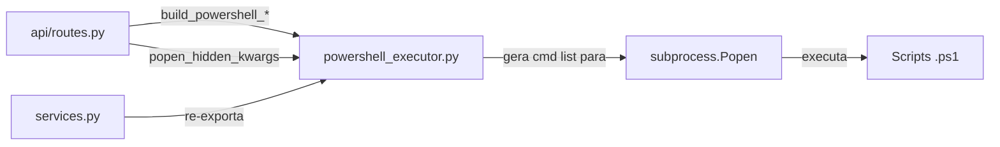

# `backend/powershell_executor.py`

## Responsabilidade

> Módulo de construção de comandos PowerShell. Gera listas de argumentos seguras para `subprocess.Popen` e configura execução silenciosa no Windows.

Este módulo isola toda a complexidade de invocar PowerShell a partir do Python: escape de caracteres especiais, configuração de encoding UTF-8 no console Windows, e ocultação de janelas de terminal.

## Localização

```
backend/powershell_executor.py
```

## Dependências

### Externas
| Biblioteca | Propósito |
|---|---|
| `os` | Detecção de sistema operacional (`os.name == 'nt'`) |
| `subprocess` | Tipos `STARTUPINFO`, `STARTF_USESHOWWINDOW`, `CREATE_NO_WINDOW` |

---

## Constante: `UTF8_PREAMBLE`

```python
UTF8_PREAMBLE = (
    '[Console]::InputEncoding = [System.Text.UTF8Encoding]::new($false); '
    '[Console]::OutputEncoding = [System.Text.UTF8Encoding]::new($false); '
    '$OutputEncoding = [Console]::OutputEncoding; '
    'chcp 65001 > $null; '
)
```

**Propósito**: Bloco de código PowerShell injetado antes de cada script para forçar UTF-8 no console Windows.

**O que cada linha faz**:

| Instrução PowerShell | Efeito |
|---|---|
| `[Console]::InputEncoding = UTF8Encoding::new($false)` | Define encoding de entrada da sessão como UTF-8 (sem BOM) |
| `[Console]::OutputEncoding = UTF8Encoding::new($false)` | Define encoding de saída (stdout) como UTF-8 (sem BOM) |
| `$OutputEncoding = [Console]::OutputEncoding` | Sincroniza a variável `$OutputEncoding` usada pelos cmdlets Write-* |
| `chcp 65001 > $null` | Altera a code page do console para UTF-8 (65001); saída redirecionada para null para não poluir o stdout |

**Por que `$false` (sem BOM)?** BOM (Byte Order Mark) é uma sequência de 3 bytes no início de arquivos UTF-8. Se o Python receber stdout com BOM, o `json.loads()` falhará ao tentar parsear o JSON, pois o BOM não é JSON válido.

**Por que esta abordagem vs. encoding no Popen?** O `subprocess.Popen` pode especificar `encoding='utf-8'`, mas isso não controla o que o PowerShell *emite*. A configuração precisa acontecer *dentro* da sessão PowerShell para garantir que os scripts (que fazem `Write-Output`) usem UTF-8.

---

## Funções

### `build_powershell_command(script_path, file_path, sheet_name) -> list`

**Propósito**: Constrói o comando para invocar `Validate-ExcelData.ps1` com os parâmetros de caminho de arquivo e nome de aba.

```python
def build_powershell_command(script_path: str, file_path: str, sheet_name: str) -> list:
    escaped_script_path = script_path.replace("'", "''")
    escaped_file_path = file_path.replace("'", "''")
    escaped_sheet_name = sheet_name.replace("'", "''")

    return [
        'powershell.exe',
        '-ExecutionPolicy', 'Bypass',
        '-NoProfile',
        '-Command',
        (
            f"{UTF8_PREAMBLE}& '{escaped_script_path}' "
            f"-ExcelPath '{escaped_file_path}' -SheetName '{escaped_sheet_name}'"
        )
    ]
```

**Escape de aspas simples**: Em PowerShell, a aspa simples `'` delimita strings literais. Para incluir uma aspa simples *dentro* de uma string delimitada por aspas simples, é necessário dobrá-la `''`. Isso previne **injeção de comandos PowerShell** via nomes de arquivo maliciosos.

**Exemplo de ataque prevenido**:
- Filename malicioso: `arquivo'; Remove-Item C:\Windows -Recurse; #.xlsx`
- Sem escape: `& 'Validate.ps1' -ExcelPath 'arquivo'; Remove-Item C:\Windows -Recurse; #.xlsx'` ← EXECUTA COMANDO INJETADO
- Com escape: `& 'Validate.ps1' -ExcelPath 'arquivo''; Remove-Item C:\Windows -Recurse; #.xlsx'` ← String literal, inofensiva

**`-ExecutionPolicy Bypass`**: Permite executar os scripts `.ps1` sem exigir que sejam assinados digitalmente. Necessário porque os scripts são internos e não têm assinatura.

**`-NoProfile`**: Não carrega o perfil PowerShell do usuário (`$PROFILE`). Isso garante execução determinística — o perfil do usuário pode ter aliases, funções ou importações que interfeririam nos scripts.

---

### `build_powershell_populate_command(script_path, file_path) -> list`

**Propósito**: Constrói o comando para `Populate-SharePointList.ps1`, que não recebe `-SheetName` (processa PESSOAS e EQUIPAMENTOS internamente de uma vez).

A diferença em relação a `build_powershell_command` é que este script foi projetado para processamento unificado das duas abas em uma única invocação, enquanto `Validate-ExcelData.ps1` valida uma aba por vez.

---

### `build_powershell_template_update_command(script_path, template_path) -> list`

**Propósito**: Constrói o comando para `Update-ExcelTemplateChoices.ps1`, que recebe o caminho do template (não de um arquivo de upload) e usa `-TemplatePath` em vez de `-ExcelPath`.

---

### `popen_hidden_kwargs() -> dict`

**Propósito**: Retorna kwargs para `subprocess.Popen` que ocultam a janela de terminal no Windows.

```python
def popen_hidden_kwargs() -> dict:
    if os.name != 'nt':
        return {}

    startupinfo = subprocess.STARTUPINFO()
    startupinfo.dwFlags |= subprocess.STARTF_USESHOWWINDOW
    startupinfo.wShowWindow = 0
    return {
        'startupinfo': startupinfo,
        'creationflags': subprocess.CREATE_NO_WINDOW
    }
```

**Por que duas abordagens (`startupinfo` + `creationflags`)?** São mecanismos complementares no Windows:
- `STARTF_USESHOWWINDOW + wShowWindow = 0`: Controla a janela do *processo filho*
- `CREATE_NO_WINDOW`: Previne a criação de uma janela de console para o *novo processo*

Usar ambos garante que nenhuma janela preta de PowerShell apareça brevemente na tela do usuário durante o processamento.

**Por que `if os.name != 'nt': return {}`?** Em Linux/macOS, `subprocess.STARTUPINFO` não existe. Retornar um dict vazio significa que `**popen_hidden_kwargs()` no Popen simplesmente não passa nenhum argumento extra — comportamento correto e sem janelas para ocultar em sistemas Unix.

---

## Interações com Outros Módulos



## Nota de Segurança

O escape de aspas simples (`replace("'", "''")`) previne injeção de comandos PowerShell via caminhos de arquivo. Entretanto, caminhos de arquivo recebidos do usuário (via `request.files`) passam por `werkzeug.utils.secure_filename()` em `routes.py` antes de chegar aqui, adicionando uma segunda camada de proteção.
