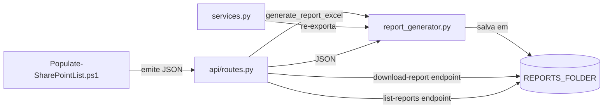

# `backend/report_generator.py`

## Responsabilidade

> Geração de relatório Excel estilizado com a paleta de cores Vestas, sumarizando o resultado da submissão ao SharePoint.

Após a inserção de registros no SharePoint, o script PowerShell emite um JSON estruturado com o resultado de cada item (ID gerado, status, campos). Este módulo converte esse JSON em um arquivo `.xlsx` visualmente organizado, pronto para ser baixado pelo analista.

## Localização

```
backend/report_generator.py
```

## Dependências

### Internas
| Módulo | Por quê |
|---|---|
| `backend.config.REPORTS_FOLDER` | Diretório onde o Excel gerado é salvo |

### Externas
| Biblioteca | Propósito |
|---|---|
| `openpyxl` | Criação do workbook Excel |
| `openpyxl.styles` | Cores, bordas, fontes, alinhamento |
| `openpyxl.utils.get_column_letter` | Converter índice numérico de coluna para letra (ex: 3 → `C`) |
| `datetime` | Timestamp no nome do arquivo para unicidade |
| `re` | Sanitização do ID de mobilização para uso no nome do arquivo |

---

## Paleta de Cores Vestas

```python
COLOR_NIGHT_SKY  = '1F3144'  # Azul escuro — cabeçalhos principais
COLOR_BLUE_SKY   = '005AFF'  # Azul vibrante — não usado diretamente, reservado
COLOR_LIGHT_GREY = 'E3E5E8'  # Cinza claro — linhas alternadas
COLOR_GREEN_FILL = 'D4EDDA'  # Verde suave — linhas com sucesso
COLOR_RED_FILL   = 'F8D7DA'  # Vermelho suave — linhas com erro
COLOR_WHITE      = 'FFFFFF'  # Branco — texto em fundos escuros
COLOR_LABEL_BG   = 'EBF3FB'  # Azul muito claro — labels de metadados
```

As cores seguem a identidade visual da Vestas, mantendo consistência com outros documentos internos.

---

## Função Principal: `generate_report_excel(report_data: dict) -> tuple[str, str]`

**Propósito**: Cria um arquivo Excel completo com metadados da submissão e tabela de resultados por item.

**Parâmetros**:
| Nome | Tipo | Descrição |
|---|---|---|
| `report_data` | `dict` | JSON emitido pelo script `Populate-SharePointList.ps1` |

**Estrutura esperada de `report_data`**:
```python
{
    "id_mobilizacao": "MOB-2024-001",
    "submission_datetime": "2024-11-15T14:30:00",
    "requester_name": "João Silva",
    "requester_email": "joao.silva@vestas.com",
    "items": [
        {
            "id_sp": 42,             # ID do item criado no SharePoint
            "status": "Inserido",    # ou "Erro: ..."
            "fields": {              # Campos submetidos
                "Nome": "Pedro Costa",
                "Cargo": "Eletricista",
                ...
            }
        }
    ]
}
```

**Retorno**: `(report_filename, report_path)` — nome do arquivo e caminho absoluto

---

### Estrutura do Excel Gerado

```
Linha 1:     TÍTULO — "RELATÓRIO DE SUBMISSÃO — MOBILIZAÇÕES VESTAS" (mesclado, fundo azul escuro)
Linhas 2-5:  METADADOS — Data/Hora, ID de Mobilização, Solicitante, E-mail
Linha 6:     (espacamento)
Linha 7:     (espacamento)
Linha 8:     CABEÇALHO DA TABELA — ID Elemento | Status | [campos dinâmicos]
Linha 9+:    DADOS — uma linha por item, verde (sucesso) ou vermelho (erro)
```

### Detecção Dinâmica de Colunas

```python
display_cols: list[str] = []
seen: set[str] = set()
for item in items:
    for col_name in (item.get('fields') or {}).keys():
        if col_name not in seen:
            seen.add(col_name)
            display_cols.append(col_name)
```

**Por que dinâmico?** Os campos no SharePoint podem variar por tipo de mobilização. O relatório se adapta automaticamente ao conjunto de campos presentes no JSON, sem hardcode de nomes de colunas.

**Por que `set` para deduplicação + `list` para ordem?** `set` garante que cada coluna apareça uma vez; a `list` preserva a ordem de aparição (Python 3.7+ garante ordem de inserção em dicts, mas a abordagem explícita com `seen` é mais clara quanto à intenção).

---

### Lógica de Colorização das Linhas

```python
is_error = 'Erro' in str(item.get('status', ''))
row_fill = fill_error if is_error else fill_success
```

A linha fica vermelha se o status contém a string `'Erro'`. Esta é uma heurística baseada no formato de status emitido pelo script PowerShell (ex: `"Erro: timeout ao conectar"`). Não é uma verificação de código de status numérico — qualquer status que contenha "Erro" é tratado como falha.

---

### Nome de Arquivo com Unicidade

```python
safe_id = re.sub(r'[^A-Za-z0-9]', '_', id_mob) if id_mob else 'sem_id'
timestamp = datetime.now().strftime('%Y%m%d_%H%M%S_%f')
report_filename = f'Relatorio_Mob_{safe_id}_{timestamp}.xlsx'
```

- `re.sub(r'[^A-Za-z0-9]', '_', id_mob)`: Sanitiza o ID de mobilização para uso em nome de arquivo, substituindo qualquer caractere não-alfanumérico por `_`
- `%f` no strftime: Microsegundos — garante unicidade mesmo se dois relatórios forem gerados no mesmo segundo

---

### Largura Adaptativa de Colunas

```python
for col_offset, col_name in enumerate(display_cols, start=3):
    estimated = max(14, min(len(col_name) + 4, 40))
    ws.column_dimensions[get_column_letter(col_offset)].width = estimated
```

A largura é estimada pelo comprimento do nome da coluna, com mínimo de 14 e máximo de 40 caracteres. Isso é uma heurística — não considera o conteúdo das linhas, apenas o cabeçalho.

---

## Interações com Outros Módulos


