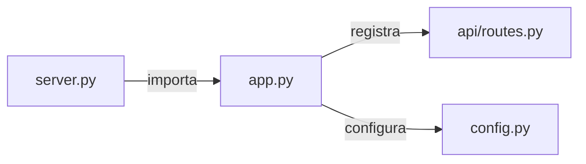

# `backend/server.py`

## Responsabilidade

> Ponto de entrada da aplicação. Inicializa o servidor Flask com configurações de produção.

Este arquivo é o **entrypoint** do sistema — o único arquivo que deve ser executado diretamente para iniciar o servidor web. Ele deliberadamente não contém lógica de negócio: sua única responsabilidade é importar a instância Flask já configurada e chamar `app.run()`.

## Localização

```
backend/server.py
```

## Dependências

### Internas
| Módulo | Por quê é importado |
|---|---|
| `backend.app` | Importa a instância Flask completamente configurada (blueprints, config, pastas) |

### Externas
Nenhuma dependência externa direta.

---

## Código Completo e Análise

```python
from backend.app import app

if __name__ == '__main__':
    print('Servidor rodando em http://localhost:5000')
    app.run(debug=False, host='0.0.0.0', port=5000, threaded=True)
```

### Análise linha por linha

**`from backend.app import app`**
Importa a instância Flask já totalmente configurada. Toda a montagem da aplicação (registro de blueprints, configuração de pastas, importação de constantes) acontece em `app.py`. `server.py` apenas consome o resultado final.

**`if __name__ == '__main__':`**
Garante que o servidor só é iniciado quando o arquivo é executado diretamente (`python server.py`), não quando importado como módulo por outra ferramenta (ex: WSGI, testes).

**`app.run(debug=False, host='0.0.0.0', port=5000, threaded=True)`**

| Parâmetro | Valor | Por quê |
|---|---|---|
| `debug=False` | Desativado | Ambiente interno/produção; o modo debug expõe o Werkzeug debugger |
| `host='0.0.0.0'` | Todas as interfaces | Permite acesso de outras máquinas na rede local (intranet Vestas) |
| `port=5000` | 5000 | Porta padrão Flask; sem conflito com outros serviços comuns |
| `threaded=True` | Ativado | Permite múltiplas requisições simultâneas; essencial para o streaming SSE do `/run-script` |

**Por que `threaded=True` é crítico aqui**: O endpoint `/run-script` usa `Response(stream_with_context(...))` com `subprocess.Popen` fazendo `readline()` em loop. Sem `threaded=True`, uma requisição de streaming bloquearia o servidor inteiro, impedindo que o browser receba as atualizações de progresso.

---

## Interações com Outros Módulos



## Como Executar

```bash
# A partir da raiz do projeto:
python -m backend.server

# Ou via script batch:
backend/scripts/run_web.bat
```
