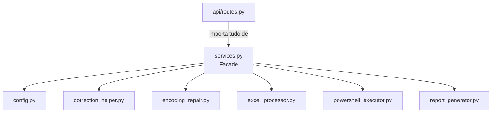

# `backend/services.py`

## Responsabilidade

> Camada de compatibilidade — centraliza e re-exporta símbolos de todos os módulos especializados do backend.

`services.py` é uma **Facade de re-exports**: não contém lógica de negócio própria (além de duas funções de persistência de status de template). Seu papel é ser o único ponto de importação para `api/routes.py`, desacoplando os endpoints dos módulos internos concretos.

## Localização

```
backend/services.py
```

## Padrão Arquitetural: Facade



**Por que este padrão?** Se `routes.py` importasse diretamente de cada módulo, qualquer refatoração (ex: renomear `excel_processor.py`) exigiria alterar `routes.py`. Com a facade, a mudança fica contida em `services.py`.

---

## Re-exports por Módulo de Origem

### De `backend.config`
```python
from backend.config import (
    ALLOWED_EXTENSIONS,
    REPORTS_FOLDER,
    TEMPLATE_FILENAME,
    TEMPLATE_STATUS_FILE,
    UPLOAD_FOLDER,
)
```

### De `backend.correction_helper`
```python
from backend.correction_helper import (
    allowed_file,
    extract_lista_suspensa_columns,
    normalize_key,
)
```

### De `backend.encoding_repair`
```python
from backend.encoding_repair import (
    decode_powershell_output,
    has_mojibake_markers,
    repair_mojibake,
    repair_mojibake_once,
    score_decoded_text,
)
```

### De `backend.excel_processor` (com aliases de prefixo `_`)
```python
from backend.excel_processor import (
    count_excel_rows as _count_excel_rows,
    create_group_workbook as _create_group_workbook,
    read_grouped_excel as _read_grouped_excel,
    row_has_any_data as _row_has_any_data,
    value_to_exact_text as _value_to_exact_text,
)
```

**Por que o prefixo `_`?** As funções `_create_group_workbook` e `_read_grouped_excel` são funções de implementação interna que o `routes.py` usa diretamente. O prefixo `_` na convenção Python sinaliza "interno ao módulo". Aqui, serve como indicação de que são detalhes de implementação expostos à Facade, não parte da API pública do serviço.

### De `backend.powershell_executor`
```python
from backend.powershell_executor import (
    build_powershell_command,
    build_powershell_populate_command,
    build_powershell_template_update_command,
    popen_hidden_kwargs as _popen_hidden_kwargs,
)
```

### De `backend.report_generator`
```python
from backend.report_generator import generate_report_excel
```

---

## Funções Próprias

### `get_template_status() -> dict`

```python
def get_template_status():
    if not os.path.exists(TEMPLATE_STATUS_FILE):
        return {"last_updated": None}
    try:
        with open(TEMPLATE_STATUS_FILE, "r", encoding="utf-8") as f:
            data = json.load(f)
            return {"last_updated": data.get("last_updated")}
    except Exception:
        return {"last_updated": None}
```

**Propósito**: Lê o arquivo JSON `template_update_status.json` e retorna a data da última atualização do template Excel.

**Fluxo**:
1. Se o arquivo não existe → retorna `{"last_updated": None}` (template nunca atualizado)
2. Se o arquivo existe → lê e extrai apenas a chave `last_updated`
3. Se qualquer erro ocorrer (JSON corrompido, permissão) → retorna `{"last_updated": None}` em vez de lançar exceção

**Por que retornar `None` em vez de lançar exceção?** Este endpoint (`GET /template-update-status`) é informacional. Falhar silenciosamente e retornar `null` é preferível a retornar HTTP 500 para uma funcionalidade não-crítica.

---

### `save_template_status(iso_datetime: str) -> None`

```python
def save_template_status(iso_datetime):
    payload = {"last_updated": iso_datetime}
    with open(TEMPLATE_STATUS_FILE, "w", encoding="utf-8") as f:
        json.dump(payload, f, ensure_ascii=False, indent=2)
```

**Propósito**: Persiste a data/hora de atualização do template em JSON após execução bem-sucedida do script `Update-ExcelTemplateChoices.ps1`.

**Parâmetros**:
| Nome | Tipo | Descrição |
|---|---|---|
| `iso_datetime` | `str` | Data/hora no formato ISO 8601 (ex: `2024-11-15T14:30:00.123456`) |

**Por que ISO 8601?** Formato universal, ordenável lexicograficamente, sem ambiguidade de fuso horário no contexto de uma ferramenta interna.
