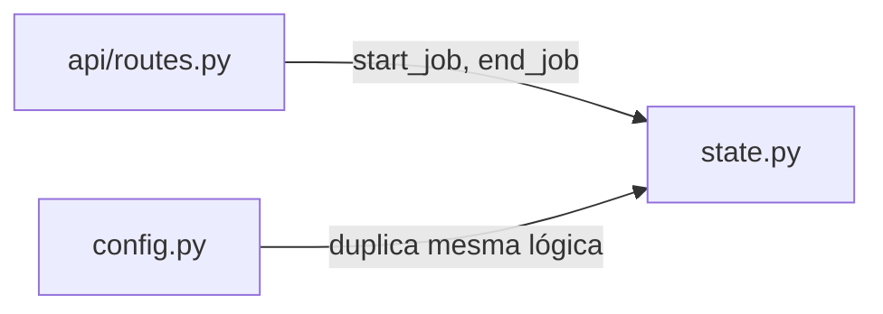

# `backend/state.py`

## Responsabilidade

> Módulo de estado de concorrência. Mantém um contador thread-safe de jobs ativos para rastrear operações longas em andamento.

## Localização

```
backend/state.py
```

## Dependências

### Externas
| Biblioteca | Propósito |
|---|---|
| `threading` | `threading.Lock` para operações atômicas no contador |

---

## Código Completo

```python
import threading

ACTIVE_JOBS = 0
JOBS_LOCK = threading.Lock()


def start_job() -> None:
    global ACTIVE_JOBS
    with JOBS_LOCK:
        ACTIVE_JOBS += 1


def end_job() -> None:
    global ACTIVE_JOBS
    with JOBS_LOCK:
        if ACTIVE_JOBS > 0:
            ACTIVE_JOBS -= 1
```

## Análise

Este módulo é a versão simplificada do controle de jobs que também existe em `config.py`. A diferença é que `state.py` **não tem** `get_active_jobs()` — apenas incrementa e decrementa.

**Quem usa `state.py`?** O `api/routes.py` importa `start_job` e `end_job` diretamente de `backend.state` (não via `services.py`). Cada endpoint que invoca PowerShell chama `start_job()` no início e `end_job()` no bloco `finally`.

**Padrão de uso em `routes.py`**:
```python
@api_bp.route('/validate', methods=['POST'])
def validate():
    start_job()
    try:
        # ... lógica de validação ...
    finally:
        end_job()  # Sempre executado, mesmo em exceção
```

O `finally` garante que `end_job()` seja chamado mesmo se a função lançar uma exceção não tratada, prevenindo que o contador fique inflado indefinidamente.

## Relação com `config.py`

`config.py` define as mesmas variáveis e funções (`ACTIVE_JOBS`, `JOBS_LOCK`, `start_job`, `end_job`, `get_active_jobs`). Esta duplicação é uma **dívida técnica**: `state.py` foi provavelmente criado para separar responsabilidades, mas `config.py` não foi limpo. Ver [improvements.md](../improvements.md).

## Interações com Outros Módulos


