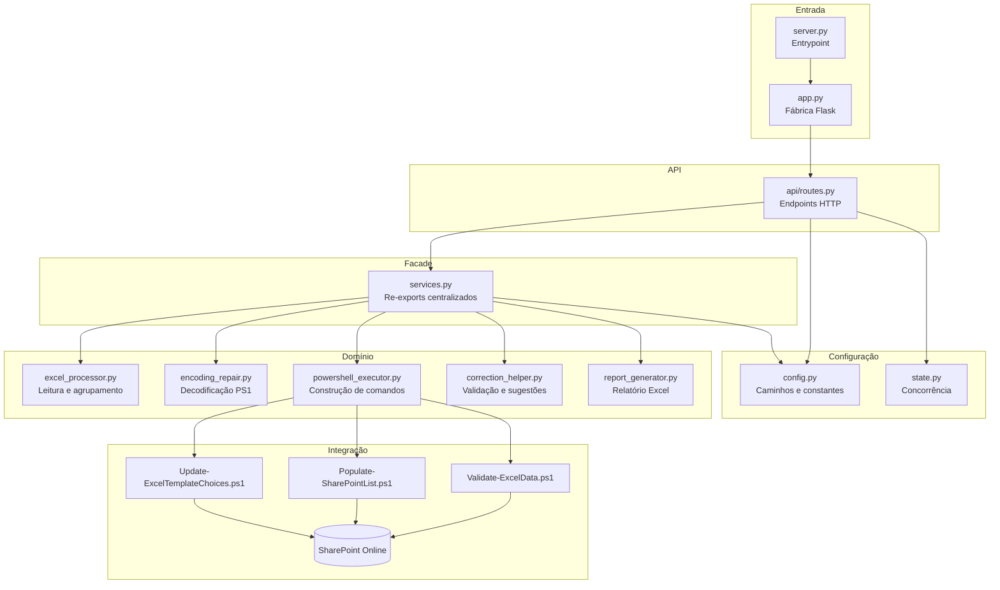

# Visão Geral dos Módulos

## Mapa Funcional

O backend é organizado em módulos com responsabilidades bem definidas:



## Índice de Módulos

| Arquivo | Tipo | Responsabilidade | Dependentes |
|---|---|---|---|
| [server.py](../files/server.md) | Entrypoint | Inicializa servidor Flask | Nenhum |
| [app.py](../files/app.md) | Factory | Monta instância Flask, registra blueprint | `server.py` |
| [config.py](../files/config.md) | Config | Caminhos, constantes, controle de jobs | Todos |
| [state.py](../files/state.md) | State | Contador de jobs ativos (threading) | `api/routes.py` |
| [services.py](../files/services.md) | Facade | Re-exports centralizados | `api/routes.py` |
| [excel_processor.py](../files/excel-processor.md) | Domain | Leitura, agrupamento, workbooks temp | `services.py` |
| [encoding_repair.py](../files/encoding-repair.md) | Util | Reparo de mojibake PowerShell | `services.py` |
| [powershell_executor.py](../files/powershell-executor.md) | Integration | Construção de comandos PS1 seguros | `services.py` |
| [correction_helper.py](../files/correction-helper.md) | Util | Normalização e sugestões de dropdown | `services.py` |
| [report_generator.py](../files/report-generator.md) | Domain | Geração de Excel estilizado Vestas | `services.py` |
| [api/routes.py](../files/routes.md) | Controller | Todos os endpoints HTTP | Nenhum |

## Fluxos de Dados Principais

### Fluxo de Validação

```
Browser → POST /validate
  → secure_filename(file.filename)
  → file.save(UPLOAD_FOLDER)
  → _read_grouped_excel()         [excel_processor]
  → _create_group_workbook()      [excel_processor] × N grupos
  → build_powershell_command()    [powershell_executor]
  → subprocess.Popen()
  → decode_powershell_output()    [encoding_repair]
  → json.loads(JSON entre marcadores)
  → jsonify({status, errors, group_summary})
```

### Fluxo de Submissão (Streaming)

```
Browser → POST /run-script
  → _read_grouped_excel()
  → Para cada GRUPO:
      → _create_group_workbook()
      → build_powershell_populate_command()
      → subprocess.Popen (streaming readline)
      → decode_powershell_output() por linha
      → yield decoded (SSE para browser)
      → Ao detectar ---REPORT_JSON_START---:
          → json.loads(report_json_lines)
          → generate_report_excel(report_data)   [report_generator]
          → yield f'---REPORT_FILE:{filename}---'
  → yield ---GROUP_SUMMARY_JSON_START---
```

### Fluxo de Sugestões de Correção

```
Browser → POST /suggest-corrections
  → extract_lista_suspensa_columns(file_path)   [correction_helper]
  → Para cada erro {campo, valor}:
      → normalize_key(campo)                     [correction_helper]
      → Busca coluna correspondente
      → Retorna options[] da coluna
  → jsonify({suggestions})
```
