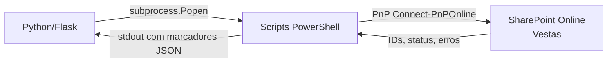

# Integrações Externas

## Visão Geral

O sistema integra-se com um único serviço externo: **SharePoint Online** da Vestas. A integração é feita exclusivamente via scripts PowerShell usando o módulo **PnP PowerShell**, invocados pelo Python através de `subprocess.Popen`.



---

## SharePoint Online

### Autenticação

A autenticação com o SharePoint é gerenciada pelos scripts PowerShell via **PnP PowerShell** com certificado digital. Os detalhes de configuração estão documentados em [`docs/README-PnP-Certificado.md`](../../backend/docs/README-PnP-Certificado.md).

### Operações

| Script | Operação SharePoint | Endpoint Python que Invoca |
|---|---|---|
| `Validate-ExcelData.ps1` | Leitura de listas de Choice para validar valores | `POST /validate` |
| `Populate-SharePointList.ps1` | `Add-PnPListItem` — cria novos itens em lista | `POST /run-script` |
| `Update-ExcelTemplateChoices.ps1` | Leitura de campos Choice da lista e atualização do Excel | `POST /update-template` |

---

## Scripts PowerShell

### `Validate-ExcelData.ps1`

**Propósito**: Valida se os valores de cada campo Choice no Excel correspondem às opções válidas da lista SharePoint.

**Parâmetros recebidos**:
- `-ExcelPath`: Caminho do workbook temporário do grupo
- `-SheetName`: Nome da aba a validar (`PESSOAS` ou `EQUIPAMENTOS`)

**Protocolo de saída** (stdout):
```
[Linhas de log para exibição]
---VALIDATION_JSON_START---
{
  "status": "success",
  "errors": []
}
---VALIDATION_JSON_END---
```

**Como o Python processa**: Extrai o bloco entre marcadores e faz `json.loads()`.

---

### `Populate-SharePointList.ps1`

**Propósito**: Cria itens no SharePoint para todas as linhas do arquivo Excel (ambas as abas PESSOAS e EQUIPAMENTOS).

**Parâmetros recebidos**:
- `-ExcelPath`: Caminho do workbook temporário do grupo

**Protocolo de saída** (stdout com streaming):
```
[Linhas de progresso em tempo real]
---REPORT_JSON_START---
{
  "id_mobilizacao": "MOB-2024-001",
  "submission_datetime": "2024-11-15T14:30:00",
  "requester_name": "João Silva",
  "requester_email": "joao@vestas.com",
  "items": [
    {
      "id_sp": 42,
      "status": "Inserido",
      "fields": {"Nome": "Pedro", "Cargo": "Eletricista"}
    }
  ]
}
---REPORT_JSON_END---
```

**Marcadores de erro detectados pelo Python**:
```
FALHA CRÍTICA
UPLOAD CANCELADO
--- RESULT: ERROR ---
Write-Error
Erro ao adicionar item
Não foi possível gerar um ID_Mobilizacao único
```

---

### `Update-ExcelTemplateChoices.ps1`

**Propósito**: Lê as opções atuais dos campos Choice da lista SharePoint e atualiza as validações de dropdown do template Excel.

**Parâmetros recebidos**:
- `-TemplatePath`: Caminho absoluto do template `ModeloSolicitacaoMob.xlsx`

**Protocolo de saída**: Log textual + código de retorno (0 = sucesso, não-zero = falha).

---

## Protocolo de Comunicação Python ↔ PowerShell

### Por que marcadores textuais em vez de exit codes?

PowerShell 5.1 frequentemente retorna código 0 mesmo quando operações parcialmente falham. Os marcadores textuais no stdout são mais confiáveis como indicadores de status.

### Encoding do stdout

O Python sempre lê o stdout como `bytes` (`universal_newlines=False`) e passa para `decode_powershell_output()`. Nunca usa `universal_newlines=True` (que forçaria decodificação automática pelo Python e poderia falhar).

### Gestão de processos

```python
process = subprocess.Popen(
    cmd,
    stdout=subprocess.PIPE,
    stderr=subprocess.STDOUT,   # Redireciona stderr para stdout
    universal_newlines=False,
    **_popen_hidden_kwargs()    # Oculta janela no Windows
)
```

`stderr=subprocess.STDOUT` redireciona mensagens de erro do PowerShell para o mesmo pipe do stdout, garantindo que erros apareçam no log exibido ao usuário.

---

## Ponto de Falha Crítico

A maior dependência externa é a **conectividade com o SharePoint Online**. Se a rede corporativa estiver indisponível, os certificados expirarem, ou as permissões da Service Account forem revogadas, **toda a funcionalidade de submissão para de funcionar**. Não há fallback local implementado.

**Recomendação**: Implementar verificação de saúde de conectividade no startup e no endpoint `GET /health` (ver [improvements.md](../improvements.md)).
